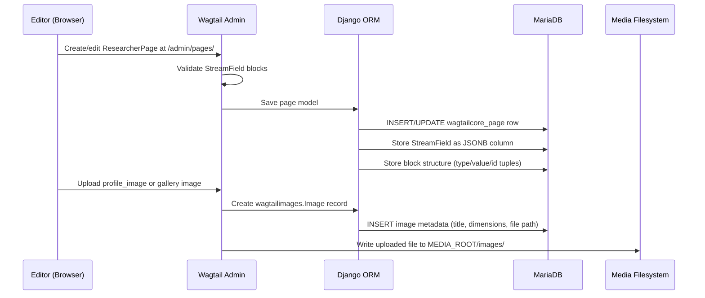
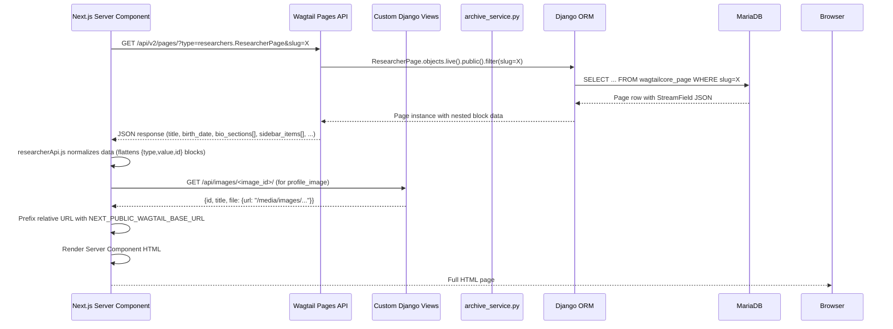
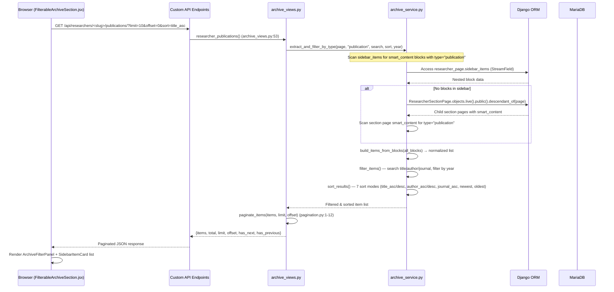
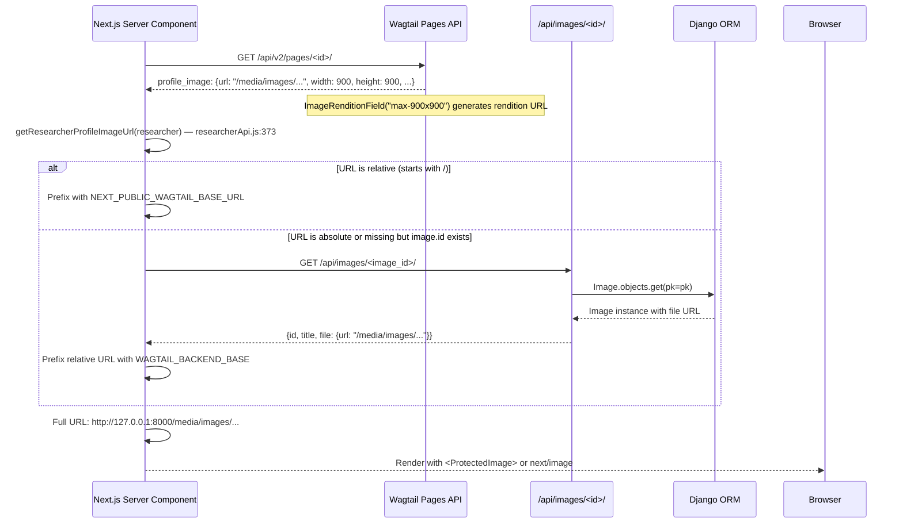
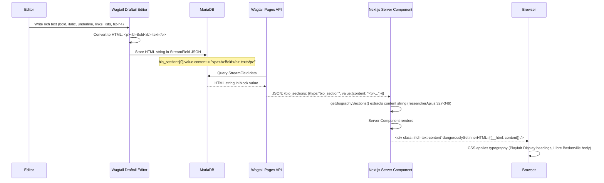

# Data Flow Architecture

> **Purpose**: End-to-end data flow from Wagtail CMS content authoring through API to Next.js React rendering.
> **Audience**: Full-stack developers, integration engineers.
> **Prerequisites**: [System overview](./system-overview.md), [API endpoints reference](../api/endpoints.md).
> **Related**: [Wagtail content architecture](./wagtail-content-architecture.md), [Frontend API integration](../api/endpoints.md#14-frontend-api-consumption-patterns).

---

## 1. Content Authoring Flow

Editors create and manage content entirely within the Wagtail admin interface at `/admin/`. The content authoring flow follows these steps:

1. **Create ResearcherPage** as a child of the HomePage at `/admin/pages/`. Wagtail's page tree enforces that only `ResearcherSectionPage` can be children of `ResearcherPage` (see `backend/researchers/models.py:30`).

2. **Fill in profile fields**: `birth_date` and `death_date` use `SelectDateWidget` with years from present back to 1900 (`models.py:88-96`). `field` is a required CharField (max 255). `profile_image` is an optional FK to Wagtail's `Image` model.

3. **Add `profile_items`**: A StreamField of label/value `StructBlock` pairs (`models.py:49-64`). Editors add rows like "Born: 1920", "Field: Physics". Each row has a `label` and `value` CharBlock.

4. **Add `bio_sections`**: A StreamField of `BiographySectionBlock` entries (`models.py:75-82`). Each is a titled rich text block. Editors write formatted biography content using bold, italic, underline, links, lists, and h2-h4 headings.

5. **Add `sidebar_items`**: A StreamField of `SidebarItemBlock` entries (`models.py:66-73`). Each sidebar item has a title, slug (becomes URL segment), optional items list of `SidebarContentItemBlock`, and optional `smart_content` StreamBlock with 5 block types: publication, guidance, news, supervision, gallery (`blocks.py:207-216`).

6. **Mix smart_content block types**: Within a single sidebar item's `smart_content`, editors can intermix publication entries, research guidance records, news clippings, student supervision records, and gallery blocks. The frontend and backend filter by type at query time.

7. **Optionally create ResearcherSectionPage children**: For standalone section content, editors create child pages of type `ResearcherSectionPage` (`models.py:119-145`). These have their own `smart_content` StreamField with the same 5 block types. The service layer uses these as a fallback when sidebar content is empty.

8. **MUST publish the page**: Draft pages are invisible to the API. Wagtail's `PagesAPIViewSet` only returns `.live().public()` pages. Content must be published at `/admin/pages/` before it appears to the frontend.

---

## 2. Storage Flow



StreamField data is stored as JSON in the database (`use_json_field=True` on all StreamFields — see `models.py:61,70,79,133`). Each block is serialized as a `{type, value, id}` tuple, where `type` is the block key (e.g., `"bio_section"`, `"sidebar_item"`, `"publication"`) and `value` is the nested struct data.

Image files are stored on the local filesystem under `MEDIA_ROOT` and served by Django in development (`urls.py:68-69`) or by nginx in production.

---

## 3. API Request Flow (Server-side)

This is the standard page render path — a Next.js Server Component fetches researcher data during server-side rendering.



The key normalization step happens in `researcherApi.js` (lines 93-128 for the main fetch, 139-201 for sidebar items, 327-349 for bio sections). The raw Wagtail API returns StreamField as `[{type: "sidebar_item", value: {...}, id: "uuid"}]` — the normalization code unwraps these into flat objects that React components can consume directly.

---

## 4. API Request Flow (Client-side — FilterableArchiveSection)

When a user navigates to a section view (publications, guidance, news), the client-side `FilterableArchiveSection` component fetches paginated, filtered data.



**7 sort modes** (defined in `sorting.py:6-28`):
| Mode | Behavior |
|------|----------|
| `title_asc` | A-Z by title (default) |
| `title_desc` | Z-A by title |
| `author_asc` | A-Z by author/student_name |
| `author_desc` | Z-A by author/student_name |
| `journal_asc` | A-Z by journal name |
| `newest` | Most recent year first |
| `oldest` | Earliest year first |

The `FilterableArchiveSection` component (`frontend/components/archive/FilterableArchiveSection.jsx:1-201`) manages pagination state client-side with `useState` for offset, loading, error, and filter values. It fetches new pages when the user clicks pagination controls or changes sort/filter settings.

---

## 5. Image Resolution Flow

Wagtail stores images as references. The frontend must resolve these references to full URLs.



**Image resolution paths** in `researcherApi.js`:

- **Profile images** (`researcherApi.js:373-395`): `getResearcherProfileImageUrl()` checks multiple paths: `profile_image.url`, `profile_image.meta.download_url`, `profile_image.file.url`, then falls back to fetching via `fetchImageDetails(profile_image.id)`.

- **Gallery images** (`researcherApi.js:203-325`): `getResearcherGalleryImages()` extracts gallery blocks from sidebar `smart_content`, normalizes them through `resolveGalleryImageEntry()`, and batches parallel image ID lookups. Falls back to `ResearcherSectionPage` with slug "gallery" if sidebar has no gallery blocks.

- **Image API endpoint** (`views.py:44-65`): `/api/images/<id>/` returns `{id, title, file: {url}}`. The frontend's `fetchImageDetails()` in `wagtailApi.js:10-35` automatically prefixes relative URLs with `WAGTAIL_BACKEND_BASE`.

- **Rendition resolution**: Wagtail's `ImageRenditionField("max-900x900")` on profile_image (`models.py:108-111`) generates rendition URLs at API response time, so the frontend receives a pre-sized image URL.

---

## 6. Dual Data Source Resolution

The `archive_service.py` resolves section content from two possible locations. This dual-source pattern exists because content can live in either the sidebar on the parent `ResearcherPage` or in standalone `ResearcherSectionPage` children.

### 6.1 Block-type extraction (`extract_and_filter_by_type`)

Defined in `archive_service.py:87-121`. Used by publication, guidance, and news endpoints.

1. **First checks sidebar_items** on the ResearcherPage for `smart_content` blocks matching the requested type (`"publication"`, `"guidance"`, or `"news"`).
2. **If none found in sidebar**, falls back to `ResearcherSectionPage` descendants (`.live().public().descendant_of(researcher_page)`). Scans each child's `smart_content` StreamField for matching block types.
3. All matched blocks are collected and passed to `build_items_from_blocks()`.

```
sidebar_items[] → sidebar_item.value.smart_content[] → {type: "publication", value: {...}}
                                                         {type: "guidance", value: {...}}
                                                         {type: "gallery", value: {...}}
        ── OR ── (fallback)

ResearcherSectionPage.smart_content[] → {type: "publication", value: {...}}
```

### 6.2 Section-slug resolution (`build_section_items`)

Defined in `archive_service.py:124-186`. Used by section-specific pages and the filtered-items endpoint.

1. **First checks sidebar_items** for a block whose slug matches the requested section slug.
2. **Then checks ResearcherSectionPage** children for a matching slug (via `.filter(slug=section_slug)`).
3. If the matched sidebar section has `items` (SidebarContentItemBlock list), those items are returned as-is.
4. If items are empty, falls back to `smart_content` blocks from the matched section.
5. If no sidebar section matched and no smart_content in the sidebar, falls back to `section_page.smart_content`.

### 6.3 Gallery resolution

Defined in `researcherApi.js:275-325`. Similar dual-source pattern:

1. Extracts all `gallery` blocks from sidebar items' `smart_content`.
2. If no gallery images found in sidebar, looks for a `ResearcherSectionPage` with slug "gallery" or title "gallery".
3. Resolves each gallery image entry to a full URL via parallel `fetchImageDetails()` calls.
4. Deduplicates by URL and ID.

---

## 7. Rich Text Rendering Flow

Wagtail's `RichTextBlock` stores formatted content as HTML. This HTML flows through the API directly to React components that render it with `dangerouslySetInnerHTML`.



**Rich text features** (registered in `wagtail_hooks.py:6-33`):

| Feature | HTML Tag | Notes |
|---------|----------|-------|
| Bold | `<b>` | Standard Draftail inline style |
| Italic | `<i>` | Standard Draftail inline style |
| Underline | `<u>` | Custom hook — not a Wagtail default. Registered as `InlineStyleFeature("UNDERLINE")` |
| Link | `<a>` | `link` feature from Draftail |
| Ordered list | `<ol><li>` | `ol` feature from Draftail |
| Unordered list | `<ul><li>` | `ul` feature from Draftail |
| Heading 2 | `<h2>` | `h2` block feature |
| Heading 3 | `<h3>` | `h3` block feature |
| Heading 4 | `<h4>` | `h4` block feature |

The frontend's `globals.css` applies academic typography to `.rich-text-content` containers:
- **Headings**: Playfair Display serif font
- **Body text**: Libre Baskerville serif font
- **Accent color**: `#8b1c1c` (deep red)

Rich text appears in three contexts:
- **Bio sections**: `BiographySectionBlock.content` rendered by `BiographySections` component (`frontend/components/researchers/BiographySections.jsx`)
- **Section content**: `SectionBlock.content` in section page layouts
- **Gallery captions**: `GalleryImageItemBlock.about_image` (limited to bold, italic, underline only — see `blocks.py:136`)

---

## 8. Data Normalization Pipeline

The `researcherApi.js` module (395 lines) is the single entry point for transforming raw Wagtail API data into component-ready structures. Each function handles a specific subset of the nested StreamField data.

### Function Reference

| Function | Lines | Input | Output | Purpose |
|----------|-------|-------|--------|---------|
| `getResearcherPageBySlugResult(slug)` | 93-128 | researcher slug | `{researcher, sectionPages, hasError}` | Two-step fetch: list by slug → detail by ID. Fetches section pages in parallel. |
| `getResearcherSectionPages(researcherId)` | 34-59 | page ID | `[{title, slug, subtitle, ...}, ...]` | Fetches child pages via `?child_of=` and filters to `researchers.ResearcherSectionPage` type. |
| `getResearcherSectionPageBySlug(researcherId, sectionSlug)` | 61-91 | ID + slug | Section page object | Finds section page by normalized slug, then fetches full detail. |
| `getSidebarItems(sidebarItems)` | 139-201 | StreamField blocks | `[{title, subtitle, slug, items[], smart_content[]}, ...]` | Unwraps `{type, value, id}` tuples. Handles both wrapped and direct value formats. Deduplicates by slug. |
| `getSidebarItemsFromSectionPages(sectionPages)` | 11-32 | Section page array | Sidebar-like item list | Derives sidebar navigation entries from section child pages when no sidebar_items exist. |
| `getBiographySections(bioSections)` | 327-349 | StreamField blocks | `[{title, content (HTML), slug}, ...]` | Filters to `bio_section` type, extracts title + rich text content. Discards entries missing title or content. |
| `getProfileItems(profileItems, limit)` | 351-371 | StreamField blocks | `[{label, value}, ...]` | Extracts label/value pairs. Default limit of 20. |
| `getResearcherProfileImageUrl(researcher)` | 373-395 | Researcher object | Full image URL string | Multi-path resolution: direct URL → meta.download_url → file URL → API fallback fetch. |
| `getResearcherGalleryImages(researcher, sectionPages)` | 275-325 | Researcher + sections | `[{id, url, title, caption, aboutImageHtml, alt}, ...]` | Dual-source gallery extraction + parallel image ID resolution + deduplication. |
| `toSectionSlug(value)` | 130-137 | Any string | URL-safe slug | Lowercases, strips non-alphanumeric, replaces spaces/hyphens. Used for slug matching and URL routing. |

### Normalization Patterns

**StreamField unwrapping**: Wagtail streams arrive as `[{type, value, id}]`. The normalizer handles two formats:
1. **Wrapped blocks**: `{type: "bio_section", value: {title: "...", content: "..."}, id: "uuid"}` — standard StreamField format
2. **Direct values**: `{title: "...", content: "..."}` — occurs when data is pre-flattened or comes from certain API versions

The code handles both patterns defensively with `block?.value || block` fallback chains.

**Slug normalization**: `toSectionSlug()` converts any string to a URL-safe format by lowercasing, removing special characters, collapsing whitespace to hyphens, and deduplicating consecutive hyphens. Both frontend and backend have equivalent implementations (`researcherApi.js:130-137` and `text_utils.py`).

**Image URL resolution**: All image URL resolution follows the same pattern — check for a direct URL first, prefix relative URLs with `WAGTAIL_BACKEND_BASE`, and fall back to the `/api/images/<id>/` endpoint if only an ID is available.

**Gallery deduplication**: Gallery images are deduplicated by both URL equality and ID equality, ensuring the same image referenced from multiple blocks appears only once.

---

## Cross-Reference Index

| Topic | Primary Source | Docs Reference |
|-------|---------------|----------------|
| Page type constraints | `backend/researchers/models.py:28-145` | [Wagtail content architecture](./wagtail-content-architecture.md#1-page-type-hierarchy) |
| StreamField block definitions | `backend/researchers/blocks.py:1-220` | [Wagtail content architecture](./wagtail-content-architecture.md#4-streamfield-block-reference) |
| API endpoint routes | `backend/backend/urls.py:1-69` | [API endpoint reference](../api/endpoints.md#endpoint-reference-table) |
| Filter/sort logic | `backend/researchers/services/archive_service.py:87-234` | [Section 6 above](#6-dual-data-source-resolution) |
| Sort modes | `backend/researchers/utils/sorting.py:6-28` | [Section 4 above](#4-api-request-flow-client-side---filterablearchivesection) |
| Pagination | `backend/researchers/utils/pagination.py:1-12` | [Pagination architecture](./pagination-architecture.md) |
| Frontend normalization | `frontend/app/researcher/[slug]/researcherApi.js:1-395` | [Section 8 above](#8-data-normalization-pipeline) |
| Image resolution | `frontend/app/lib/wagtailApi.js:10-35` | [Section 5 above](#5-image-resolution-flow) |
| Rich text hooks | `backend/researchers/wagtail_hooks.py:1-33` | [Section 7 above](#7-rich-text-rendering-flow) |
| Rich text features | `backend/researchers/blocks.py:5-15` | [Wagtail content architecture](./wagtail-content-architecture.md#5-rich-text-features) |
| ProtectedImage component | `frontend/components/media/ProtectedImage.jsx:1-31` | [Section 5 above](#5-image-resolution-flow) |
| FilterableArchiveSection | `frontend/components/archive/FilterableArchiveSection.jsx:1-201` | [Section 4 above](#4-api-request-flow-client-side---filterablearchivesection) |
| Server Component page | `frontend/app/researcher/[slug]/page.js:1-109` | [Section 3 above](#3-api-request-flow-server-side) |
