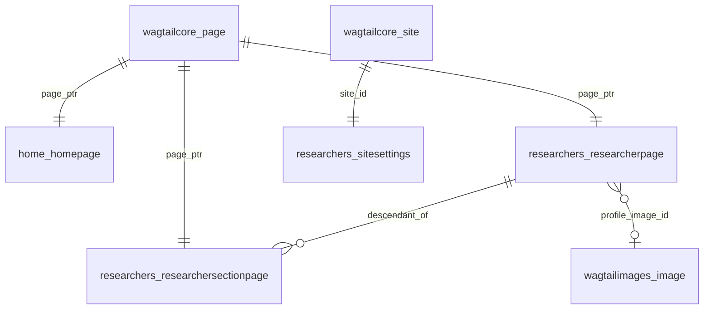

# Database Architecture

> **Purpose**: Database schema, storage strategy, and migration architecture.
> **Audience**: Backend developers, database administrators.
> **Prerequisites**: [System overview](./system-overview.md), [Wagtail content architecture](./wagtail-content-architecture.md).
> **Related**: [Migration history](../migrations/sqlite-to-mariadb.md), [Settings architecture](../backend/settings-architecture.md).

---

## 1. Database Engine

**Primary**: MariaDB 10.6+ via the `mysqlclient` driver.  
**Dev fallback**: SQLite, used automatically when no `DATABASE_URL` environment variable is set.  
**Connection**: Parsed from `DATABASE_URL` using `dj-database-url`.

Configuration from `backend/backend/settings/base.py:121-143`:

```python
DATABASE_URL = os.getenv("DATABASE_URL")

if DATABASE_URL:
    db_config = dj_database_url.parse(
        DATABASE_URL,
        conn_max_age=env_int("DJANGO_DB_CONN_MAX_AGE", 60),
        ssl_require=env_bool("DATABASE_SSL_REQUIRE", False),
    )
    if "mysql" in db_config.get("ENGINE", ""):
        db_config.setdefault("OPTIONS", {})
        db_config["OPTIONS"]["charset"] = "utf8mb4"
        db_config["OPTIONS"]["init_command"] = (
            "SET SESSION collation_connection = 'utf8mb4_general_ci'"
        )
    DATABASES = {"default": db_config}
else:
    DATABASES = {
        "default": {
            "ENGINE": "django.db.backends.sqlite3",
            "NAME": BASE_DIR / "db.sqlite3",
        }
    }
```

Key connection settings:

| Parameter | Env Var | Default | Description |
|-----------|---------|---------|-------------|
| Connection pooling | `DJANGO_DB_CONN_MAX_AGE` | 60s | Persistent connections reused for 60 seconds |
| SSL | `DATABASE_SSL_REQUIRE` | `false` | Enforce TLS for MariaDB connections |
| Charset | (hardcoded) | `utf8mb4` | Full Unicode including emoji and special characters |
| Collation | (hardcoded) | `utf8mb4_general_ci` | Case-insensitive string comparison |

---

## 2. Wagtail Page Tree Model

Wagtail uses `django-treebeard`'s **Materialized Path** model. Every page (HomePage, ResearcherPage, ResearcherSectionPage) is stored in the `wagtailcore_page` table, organized as a tree using these columns:

| Column | Description |
|--------|-------------|
| `path` | Materialized path value encoding position in the tree |
| `depth` | Integer depth from root (root = 1) |
| `numchild` | Denormalized count of immediate children |
| `content_type_id` | FK to `django_content_type`, differentiates page subclasses |
| `live` | Boolean; only published pages are `live=True` |

Page-specific data (profile fields, StreamField JSON) lives in separate tables linked via `page_ptr` — a OneToOneField to `wagtailcore.Page`.



The `page_ptr` pattern means:
- `ResearcherPage.objects.create(...)` inserts one row in `wagtailcore_page` and one in `researchers_researcherpage` (joined by PK).
- Querying `ResearcherPage.objects.live().public()` performs an automatic join through `page_ptr`.
- Deleting a `ResearcherPage` cascades to its `wagtailcore_page` row and its descendant `ResearcherSectionPage` rows.

---

## 3. StreamField Storage

Wagtail stores StreamField data as **JSON columns** in the model-specific tables (`researchers_researcherpage`, `researchers_researchersectionpage`).

### Serialization Format

Each block is serialized as:

```json
{
  "type": "block_name",
  "value": { ... },
  "id": "uuid-string"
}
```

Nested blocks (e.g., `smart_content` within `sidebar_items`) produce deeply nested JSON:

```
sidebar_items = [
  {
    type: "sidebar_item",
    value: {
      title: "Publications",
      slug: "publications",
      smart_content: [
        { type: "publication", value: { title: "...", journal: "...", ... }, id: "..." },
        { type: "publication", value: { ... }, id: "..." }
      ]
    },
    id: "..."
  }
]
```

### JSON Column Type

`use_json_field=True` on all StreamFields ensures native JSON column type on MariaDB 10.2+ and SQLite 3.9+. This provides:

- JSON validation at the database level
- JSON-specific functions (`JSON_EXTRACT`, `JSON_CONTAINS`) available (though unused by this project)

### Implications

- **No relational constraints on block content**: blocks are opaque JSON blobs. No foreign keys, no CHECK constraints, no NOT NULL enforcement within block values.
- **Cannot query/filter block content with SQL**: no JOINs on publications, guidance, or news. All filtering and sorting happens in Python after deserialization (`archive_service.py`).
- **Schema flexibility**: new block types or fields don't require `ALTER TABLE`. Only Wagtail's internal block tracking needs migration regeneration (`makemigrations` detects changed block definitions).
- **Performance degradation**: extracting items requires scanning all block data at request time. Mitigated by 300s server-side caching but cache misses are expensive.

---

## 4. Key Database Tables

| Table | Purpose | Key Columns |
|-------|---------|-------------|
| `wagtailcore_page` | Page tree (all page types) | `title`, `slug`, `path`, `depth`, `content_type_id`, `live`, `first_published_at`, `last_published_at` |
| `researchers_researcherpage` | Researcher profile data | `page_ptr`, `birth_date`, `death_date`, `field`, `profile_image_id`, `profile_items` (JSON), `sidebar_items` (JSON), `bio_sections` (JSON) |
| `researchers_researchersectionpage` | Section page data | `page_ptr`, `subtitle`, `smart_content` (JSON) |
| `researchers_sitesettings` | Institute configuration | `site_id`, `institute_name`, `department`, `address`, `phone`, `email` |
| `wagtailimages_image` | Uploaded images | `title`, `file`, `width`, `height`, `created_at` |
| `wagtailcore_site` | Django sites framework | `hostname`, `port`, `site_name`, `root_page_id`, `is_default_site` |
| `home_homepage` | Home page (root) | `page_ptr` (no extra fields) |
| `django_content_type` | Model metadata | `app_label`, `model` |
| `wagtailcore_referenceindex` | Cross-references | Tracks object references for data integrity warnings |

---

## 5. MariaDB vs SQLite Rationale

SQLite was used initially but was abandoned for production. The rationale is documented in `docs/migrations/sqlite-to-mariadb.md`.

### Why SQLite Failed

1. **Concurrency limitations**: SQLite's single-writer lock blocks all reads during writes. Wagtail's admin operations (saving pages, uploading images) combined with API requests caused lock contention.
2. **ALTER TABLE limitations**: SQLite has limited `ALTER TABLE` support, causing Wagtail's auto-generated StreamField migrations to fail or produce incorrect schemas.
3. **No native JSON type support** before SQLite 3.9: StreamField would store JSON as `TEXT`, losing validation.

### Why MariaDB Was Chosen

1. **Row-level locking**: Concurrent admin editing and API requests proceed without blocking each other.
2. **Native JSON column type**: `use_json_field=True` maps to MariaDB's native JSON type, providing validation and indexing potential.
3. **Better migration support**: Full `ALTER TABLE` capabilities for complex schema changes.
4. **utf8mb4 charset**: Full Unicode support including emoji and special characters in researcher content.
5. **Mature Django support**: `mysqlclient` driver and `dj-database-url` are well-tested with Django.

### Development Fallback

SQLite remains as the dev fallback for zero-config local development. When `DATABASE_URL` is unset, SQLite is used. This is acceptable for single-developer workflows where concurrency is not a concern.

---

## 6. Migration Architecture

### Researchers App

A single consolidated migration: `backend/researchers/migrations/0001_initial.py`.

It creates all 3 models (`ResearcherPage`, `ResearcherSectionPage`, `SiteSettings`) and captures every Wagtail block definition via `block_lookup`. The `block_lookup` dictionary maps internal block IDs to block type, arguments, and keyword arguments — Wagtail uses this to detect schema changes when `makemigrations` runs.

```python
# Example from 0001_initial.py — block_lookup for smart_content StreamField:
'smart_content', wagtail.fields.StreamField(
    [('publication', 4), ('guidance', 5), ('news', 7), ('supervision', 8), ('gallery', 14)],
    blank=True,
    block_lookup={
        0: ('wagtail.blocks.CharBlock', (), {'required': True}),
        1: ('wagtail.blocks.CharBlock', (), {'required': False}),
        2: ('wagtail.blocks.IntegerBlock', (), {'required': False}),
        # ... full block hierarchy mapped by ID
    }
)
```

History: Prior incremental migrations (0002 through 0013+) were squashed after the StreamField schema mismatch bug, where `blocks.py` was updated without regenerating migrations, causing the API to silently return `undefined` for new fields. The single-migration approach ensures any `makemigrations` run detects all block changes against a known baseline.

### Home App

Separate migrations (`backend/home/migrations/`):

- `0001_initial.py` — Creates the `HomePage` model (a `Page` subclass with no extra fields).
- `0002_create_homepage.py` — Data migration: creates the default homepage and Wagtail site record.

### Migration Workflow

After any change to `blocks.py`:

```bash
cd backend
source ../.venv/Scripts/activate   # Windows
python manage.py makemigrations
python manage.py migrate
```

This is the most critical rule in the project. Skipping migrations after block changes caused the worst bug in the project's history.

---

## 7. Known Constraints

### No Full-Text Search

Search in `archive_service.py:189-217` performs Python-level substring matching — not database queries. There is no `LIKE` or full-text index on StreamField content. All items are deserialized and scanned in memory.

### No Relational Model for Content

Publications, guidance, and news items are stored as StreamField JSON, not as separate Django models. This prevents:
- SQL-level filtering and aggregation (`COUNT`, `GROUP BY`, `WHERE year > 2020`)
- Referential integrity (no foreign keys to authors, journals, or publishers)
- Database-level indexing on block fields (title, year, journal)

### Single Consolidated Migration

The squashed `0001_initial.py` loses incremental migration history. Future schema audits have no record of how the schema evolved. Reverting a specific block change requires creating a new reverse migration from the current state.

### No Database-Level Integrity on StreamField Content

Required fields (e.g., `title` on `PublicationBlock`) are enforced only at the Wagtail form/block level, not in the database. Malformed or incomplete block data can exist in the JSON column without constraint violations.

### Potential for Orphaned Content

If a `SidebarItemBlock` within `sidebar_items` is deleted from the StreamField, any `ResearcherSectionPage` children that correspond to that sidebar item become orphaned — they still exist in the page tree but have no corresponding sidebar navigation entry. The system has no mechanism to detect or warn about this.
