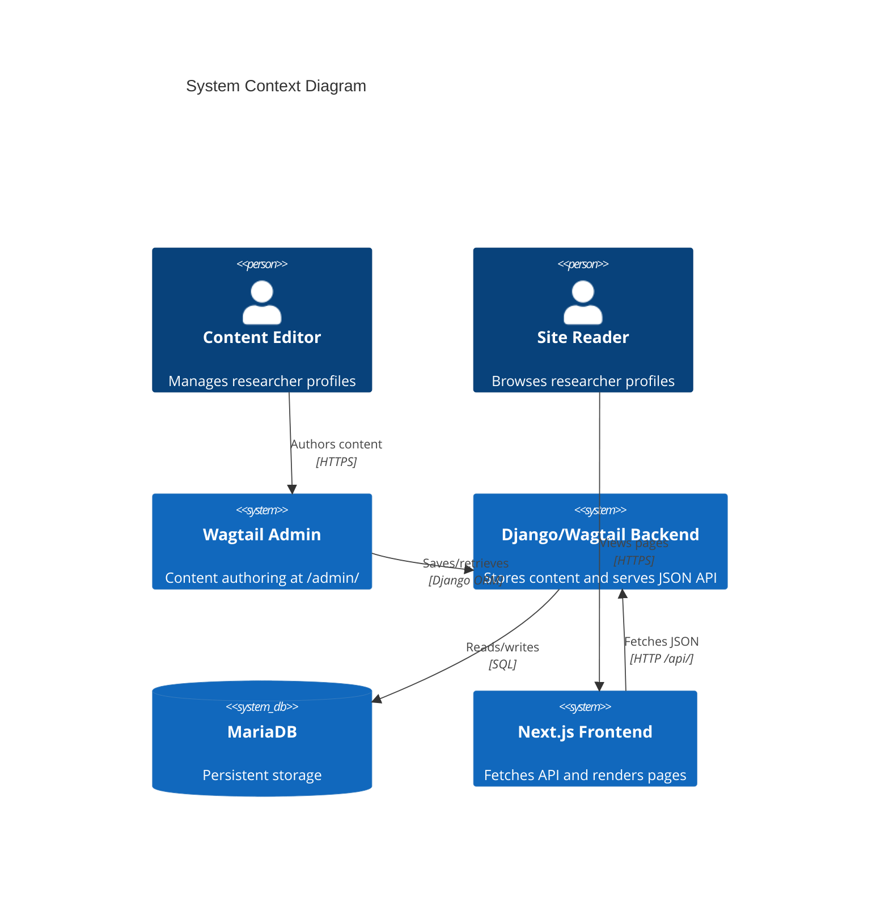
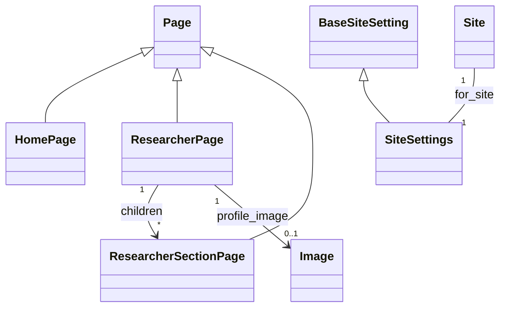

# System Architecture Overview

> **Purpose**: Comprehensive overview of the RRI Imprint Collections system architecture — headless CMS pattern, technology stack, data model, API communication, and rendering pipeline.
> **Audience**: All contributors — developers, deployment engineers, and maintainers needing a complete picture of how the system fits together.
> **Prerequisites**: [docs/README.md](../README.md) for the documentation hierarchy.
> **Related**: [data-flow.md](data-flow.md) for request lifecycle, [wagtail-content-architecture.md](wagtail-content-architecture.md) for content models, [pagination-architecture.md](pagination-architecture.md) for archive design, [decisions.md](decisions.md) for architecture records.

---

## 1. High-Level Architecture

RRI Imprint Collections follows a **headless CMS** pattern: Wagtail provides content authoring and structured storage, while Next.js handles all presentation. The two systems communicate exclusively through a JSON API — Wagtail never renders frontend pages, and Next.js never touches the database directly.



- **Editors** use the Wagtail admin at `/admin/` to create and manage structured researcher pages.
- The **Django/Wagtail backend** stores content in MariaDB (or SQLite in local dev) and exposes a read-only JSON API.
- The **Next.js React frontend** fetches API data via Server Components and renders researcher profiles, section pages, and galleries.
- **Readers** browse researcher profiles through the Next.js frontend at `:3000`.

No authentication is required for the public API. The Wagtail admin is the only authenticated surface.

---

## 2. Technology Stack

| Layer | Technology | Version | Rationale |
|-------|-----------|---------|-----------|
| Backend framework | Django | 5.2.14 | Mature Python web framework with robust ORM, admin interface hooks, and Wagtail compatibility |
| CMS | Wagtail | 7.4 | StreamField provides structured yet flexible content blocks; headless API support via `api/v2/`; settings registry for site config |
| Database (primary) | MariaDB | 10.6+ | Transactional, concurrent access for multi-editor environments; utf8mb4 for full Unicode support; required for production |
| Database (dev fallback) | SQLite | — | Zero-config local development; auto-selected when `DATABASE_URL` is absent |
| Frontend framework | Next.js | 16.2.3 | App Router with Server Components for server-side data fetching; Turbopack for fast dev builds; ISR for cacheable content |
| UI library | React | 19.2.4 | Component model for interactive UI (SidebarNavigation, FilterableArchiveSection, GalleryCarousel) |
| Styling | Tailwind CSS | v4 | Utility-first CSS with `@tailwindcss/postcss` plugin; `cn()` utility combines `clsx` + `tailwind-merge` for class composition |
| Language (backend) | Python | — | Django/Wagtail ecosystem standard |
| Language (frontend) | JavaScript | — | No TypeScript; `.js` for plain JS, `.jsx` for JSX |
| Cache | Redis (prod) / LocMem (dev) | 5.3+ | Redis for shared cache across processes in production; LocMem for single-process dev; 300s default TTL |
| WSGI server | Gunicorn | 22.0 | Production-grade WSGI server for Django |
| Static/media serving | nginx (prod) / Django (dev) | — | nginx for production performance; Django runserver for dev convenience |

---

## 3. Data Model

### 3.1 HomePage

A simple Wagtail `Page` subclass with no additional fields (`backend/home/models.py`). Serves as the root of the page tree. All `ResearcherPage` instances are created as children of the Home page.

### 3.2 ResearcherPage

The primary content model (`backend/researchers/models.py:28`). Each instance represents one researcher profile.

| Field | Type | Required | Description |
|-------|------|----------|-------------|
| `title` | CharField (inherited) | Yes | Researcher name |
| `birth_date` | DateField | No | Date of birth |
| `death_date` | DateField | No | Date of death |
| `field` | CharField (max 255) | Yes | Research field/discipline |
| `profile_image` | FK to Image | No | Profile photo; nullable with `SET_NULL` on delete |
| `profile_items` | StreamField | No | Label/value pairs (e.g., "Born: 1924") |
| `sidebar_items` | StreamField | No | Sidebar navigation sections with smart content |
| `bio_sections` | StreamField | No | Rich text biography sections |

Allowed child pages: `ResearcherSectionPage` only.

### 3.3 ResearcherSectionPage

Child pages of `ResearcherPage` (`backend/researchers/models.py:119`). Represent standalone section content (publications, guidance, news, supervision, gallery).

| Field | Type | Required | Description |
|-------|------|----------|-------------|
| `subtitle` | CharField | No | Section subtitle |
| `smart_content` | StreamField | No | Mixed content blocks (5 block types) |

The `smart_content` StreamField accepts these block types: `publication`, `guidance`, `news`, `supervision`, `gallery`.

### 3.4 SiteSettings

Global institute configuration (`backend/researchers/models.py:148`), registered via `@register_setting`. One instance per Wagtail Site.

| Field | Type | Description |
|-------|------|-------------|
| `institute_name` | CharField | Institute display name |
| `department` | CharField | Department name |
| `address` | TextField | Physical address |
| `phone` | CharField (max 50) | Contact phone |
| `email` | EmailField | Contact email |

### 3.5 Model Relationships



---

## 4. StreamField Block Hierarchy

Content is stored as deeply nested StreamField JSON structures. The hierarchy below shows the block composition from `backend/researchers/blocks.py`.

```
ResearcherPage
├── profile_items[]
│   └── StructBlock(label: CharBlock, value: CharBlock)
├── bio_sections[]
│   └── BiographySectionBlock
│       ├── title: CharBlock (required)
│       └── content: RichTextBlock (required, 10 formatting features)
└── sidebar_items[]
    └── SidebarItemBlock
        ├── title: CharBlock (required)
        ├── subtitle: CharBlock (optional)
        ├── slug: CharBlock (required, used for URL routing)
        ├── items[]
        │   └── SidebarContentItemBlock
        │       ├── title: CharBlock (required)
        │       ├── link: URLBlock (optional)
        │       ├── tag: CharBlock (optional)
        │       ├── meta_text: CharBlock (optional)
        │       └── description: RichTextBlock (optional)
        └── smart_content[] (StreamBlock — all 5 block types allowed)
            ├── publication   → PublicationBlock
            │   ├── title: CharBlock (required)
            │   ├── journal: CharBlock (optional)
            │   ├── year: IntegerBlock (optional)
            │   └── link: URLBlock (optional)
            ├── guidance      → GuidanceBlock
            │   ├── student_name: CharBlock (required)
            │   ├── thesis_title: CharBlock (required)
            │   ├── year: IntegerBlock (optional)
            │   └── link: URLBlock (optional)
            ├── news          → NewsClippingBlock
            │   ├── headline: CharBlock (required)
            │   ├── source: CharBlock (optional)
            │   ├── date: DateBlock (optional)
            │   └── link: URLBlock (optional)
            ├── supervision   → StudentSupervisionBlock
            │   ├── student: CharBlock (required)
            │   ├── topic: CharBlock (required)
            │   └── year: IntegerBlock (optional)
            └── gallery       → GalleryBlock
                ├── title: CharBlock (optional)
                └── images[]
                    └── GalleryImageItemBlock
                        ├── image: ImageChooserBlock (required)
                        ├── caption: CharBlock (optional)
                        └── about_image: RichTextBlock (optional)
```

**Critical note**: `gallery` is a block type *within* `smart_content`, not a separate field on `SidebarItemBlock`. Previously documented as a sibling field (`gallery[]` alongside `smart_content[]`), this was corrected when the schema mismatch was fixed. The same StreamBlock definition is used for both `ResearcherPage.sidebar_items[].smart_content` and `ResearcherSectionPage.smart_content`.

### 4.1 Legacy Compatibility Blocks

`blocks.py` contains two compatibility shims for historical migrations:
- `RenditionImageChooserBlock` — alias for `ImageChooserBlock`
- `TextBlock` — alias for `RichTextBlock`

Additionally, `GalleryImageItemBlock.to_python()` and `bulk_to_python()` normalize legacy image-only entries (stored as bare integers/strings) into the current struct format for backward compatibility.

---

## 5. API Communication Flow

The backend exposes 1 Wagtail built-in endpoint, 7 custom endpoints, and 1 utility endpoint. All are public, read-only, with no authentication. See [docs/api/endpoints.md](../api/endpoints.md) for full request/response details.

### 5.1 Wagtail Built-in API

| Endpoint | Purpose |
|----------|---------|
| `GET /api/v2/pages/` | Returns the full page tree with nested StreamField JSON. Supports `?type=` and `?child_of=` filters. No server-side cache (frontend uses `cache: no-store`). |

This is the primary data source. The frontend fetches researcher pages by type (`researchers.ResearcherPage`) and section pages by parent (`child_of=<id>`).

### 5.2 Custom Archive Endpoints

Server-side paginated, filtered, and sorted endpoints for content extracted from StreamField blocks:

| Endpoint | Source File | Cache TTL |
|----------|-------------|-----------|
| `GET /api/researchers/<slug>/publications/` | `researchers/api/archive_views.py` | 300s |
| `GET /api/researchers/<slug>/guidance/` | `researchers/api/archive_views.py` | 300s |
| `GET /api/researchers/<slug>/news/` | `researchers/api/archive_views.py` | 300s |
| `GET /api/researchers/<slug>/sections/<slug>/count/` | `researchers/api/archive_views.py` | 300s |

These accept query parameters: `?limit=&offset=` for pagination.

### 5.3 Filtered Items Endpoint

| Endpoint | Purpose |
|----------|---------|
| `GET /api/researchers/<slug>/sections/<section_slug>/filtered-items/` | Search, filter, and sort items within a section. Accepts `?search=&sort=&year=`. |

**Note**: As of 2026-05-29, this endpoint is defined in the backend but not consumed by any frontend code. Candidate for removal.

### 5.4 Utility Endpoints

| Endpoint | Source File | Cache TTL | Purpose |
|----------|-------------|-----------|---------|
| `GET /api/images/<id>/` | `researchers/views.py` | 300s | Returns image file URL (custom because Wagtail's v2 image endpoint needed customization) |
| `GET /api/site-settings/` | `researchers/views.py` | 300s | Returns institute configuration (name, department, address, phone, email) |

---

## 6. Frontend Rendering Pipeline

The frontend follows a multi-step pipeline from API fetch to rendered page:

### 6.1 Data Fetching

Server Components fetch API data using the Wagtail base URL (`NEXT_PUBLIC_WAGTAIL_BASE_URL`, default `http://127.0.0.1:8000`):

- **Researcher list**: `GET /api/v2/pages/?type=researchers.ResearcherPage` (unauthenticated, `cache: no-store`)
- **Researcher detail**: Same endpoint, filtered by slug
- **Section pages**: `GET /api/v2/pages/?child_of=<researcher_id>` (unauthenticated, `cache: no-store`)
- **Site settings**: `GET /api/site-settings/` — fetched once and shared via ISR

### 6.2 Normalization Layer

The `researcherApi.js` module (`frontend/app/researcher/[slug]/researcherApi.js`) normalizes Wagtail's nested `{type, value, id}` StreamField JSON into flat, component-friendly structures. Key operations:
- Extracting `sidebar_items` from researcher pages
- Flattening `smart_content` blocks by type (publications, guidance, news, supervision, gallery)
- Mapping section pages to sidebar navigation items
- Extracting profile items into label/value pairs

### 6.3 Component Rendering

Normalized data flows into React components:

| Content Type | Rendered By |
|-------------|-------------|
| Smart content (publications, guidance, news, supervision) | `SmartContentRenderer` |
| Biography sections | `BiographySections` |
| Galleries | `ResearcherGalleryViewer` |
| Rich text HTML | `dangerouslySetInnerHTML` inside `.rich-text-content` containers |
| Image URLs | Prefixed with `NEXT_PUBLIC_WAGTAIL_BASE_URL` |

### 6.4 Server/Client Split

- **Server Components**: Data fetching, page layout, static rendering of bio sections and rich text content.
- **Client Components** (`"use client"`): `SidebarNavigation`, `FilterableArchiveSection`, `GalleryCarousel` — components requiring browser APIs, event handlers, or interactive state.

---

## 7. Dev vs Production

| Aspect | Development | Production | Rationale |
|--------|------------|------------|-----------|
| Settings module | `backend.settings.dev` | `backend.settings.production` | Dev auto-detects localhost and provides safe defaults; production enforces required env vars (`DATABASE_URL`, `DJANGO_SECRET_KEY`, `DJANGO_ALLOWED_HOSTS`) |
| Database | SQLite (fallback) | MariaDB via `DATABASE_URL` | SQLite for zero-config dev; MariaDB for concurrent multi-editor access and transactional integrity |
| Debug mode | `DEBUG=True` | `DEBUG=False` | Security: error pages must not expose internals in production |
| Cache backend | LocMem (in-process) | Redis if `REDIS_URL` set | LocMem for single-process dev; Redis for shared cache across gunicorn workers |
| Cache TTL | 300s default | 300s default | Consistent between environments for predictable behavior |
| CORS | `localhost:3000`, `127.0.0.1:3000` | `DJANGO_CORS_ALLOWED_ORIGINS` (comma-separated env var) | Dev uses known origins; production must be explicitly configured |
| CSRF | Localhost origins trusted | `DJANGO_CSRF_TRUSTED_ORIGINS` | Dev trusts local frontend; production requires explicit configuration |
| Static files | Django serves directly | `collectstatic` + nginx | Django dev server for convenience; nginx for production performance and cache headers |
| Media files | Django serves at `/media/` | nginx proxies to backend | Same rationale as static files |
| Security middleware | Not applied | `ApiSecurityHeadersMiddleware` | CSP, Permissions-Policy, Referrer-Policy applied only in production to avoid interfering with dev tools (Django Debug Toolbar, browser dev tools) |
| SSL | Not enforced | `SECURE_SSL_REDIRECT=True`, HSTS | HTTPS required in production |
| SECRET_KEY | Default dev key | Enforced via `ImproperlyConfigured` if missing or default | Prevents accidental deployment with weak keys |
| Static storage | `StaticFilesStorage` | `ManifestStaticFilesStorage` | Cache-busting hashes in production filenames |

---

## 8. Known Constraints and Technical Debt

### 8.1 StreamField Extraction at Request Time

All content (publications, guidance, news) is extracted from nested StreamField JSON at request time. There is no database-level indexing or filtering on individual block fields. The archive service scans the entire researcher page's StreamField data, extracts matching block types, then applies filtering/sorting/pagination in Python.

**Impact**: This works for the current scale (tens of researchers, hundreds of items) but will not scale to hundreds of researchers with thousands of items per researcher. Mitigated by 300s server-side caching, but cache misses are expensive.

### 8.2 Single Consolidated Migration

All migrations were squashed into `0001_initial.py` after the schema mismatch where `smart_content` and `gallery` fields were defined in `SidebarItemBlock` but missing from the database. Incremental migration history (0002 through 0013+) is lost.

**Impact**: Future schema changes are harder to audit; there is no record of how the schema evolved. Any rollback requires creating a new migration from the current state.

### 8.3 No Event-Driven Cache Invalidation

Cache is purely TTL-based (300 seconds). There is no signal handler or hook to invalidate cache entries when content is published or updated in the Wagtail admin.

**Impact**: Content editors must wait up to 5 minutes (or restart the dev server with LocMem cache) to see changes reflected in the API and frontend. In a production environment with multiple editors, this causes confusion.

### 8.4 Image URL Prefixing

Wagtail returns relative image URLs (e.g., `/media/images/photo.jpg`). The frontend manually prefixes these with `NEXT_PUBLIC_WAGTAIL_BASE_URL` to construct absolute URLs.

**Impact**: This breaks if the backend serves images from a CDN or if the media URL structure changes. There is no mechanism for the backend to signal the correct base URL for images.

### 8.5 No API Versioning

Custom endpoints have no version prefix (`/api/researchers/` vs `/api/v1/researchers/`). The Wagtail built-in API is versioned (`/api/v2/`), but custom endpoints are not.

**Impact**: Changing the API contract requires coordinated deployment of both backend and frontend. No path exists for running multiple API versions simultaneously during a transition.

### 8.6 Unused filtered-items Endpoint

The `GET /api/researchers/<slug>/sections/<section>/filtered-items/` endpoint is defined in the backend (`researchers/api/archive_views.py`) but is not consumed by any frontend code (verified by full source search on 2026-05-29). The frontend uses type-specific endpoints (`/publications/`, `/guidance/`, `/news/`) and the `FilterableArchiveSection` component handles filtering client-side from the fetched data.

**Impact**: Dead code in the backend. Candidate for removal after confirming no external consumers.

---

## 9. References

- [Root README.md](../../README.md) — Project overview and local dev commands
- [AGENTS.md](../../AGENTS.md) — Critical development rules (StreamField migration discipline, endpoint list, frontend conventions)
- [docs/README.md](../README.md) — Complete documentation hierarchy and onboarding paths
- [docs/api/endpoints.md](../api/endpoints.md) — Full API endpoint reference with request/response examples
- [docs/architecture/data-flow.md](data-flow.md) — Full request lifecycle from CMS to browser
- [docs/architecture/wagtail-content-architecture.md](wagtail-content-architecture.md) — Page models and block hierarchy detail
- [docs/architecture/database-architecture.md](database-architecture.md) — Schema and StreamField storage design
- [docs/architecture/caching-architecture.md](caching-architecture.md) — Cache strategy and invalidation
- [docs/architecture/pagination-architecture.md](pagination-architecture.md) — Archive pagination design
- [docs/architecture/decisions.md](decisions.md) — Architecture Decision Records
- [docs/migrations/sqlite-to-mariadb.md](../migrations/sqlite-to-mariadb.md) — SQLite to MariaDB migration history
