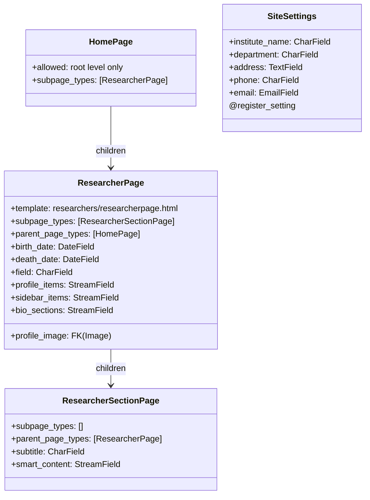

# Wagtail Content Architecture

> **Purpose**: Complete reference for Wagtail page types, StreamField block definitions, and content authoring architecture.
> **Audience**: Backend developers, content architects, Wagtail administrators.
> **Prerequisites**: [System overview](./system-overview.md).
> **Related**: [Backend models](../backend/models.md), [Data flow](./data-flow.md).

---

## 1. Page Type Hierarchy

The page tree follows a strict two-level hierarchy enforced by Wagtail's `subpage_types` and `parent_page_types` constraints.



### Page Type Constraints

| Constraint | Value | Source | Notes |
|------------|-------|--------|-------|
| HomePage children | Only `ResearcherPage` | HomePage model | Root-level page — one instance at the site root |
| ResearcherPage children | Only `ResearcherSectionPage` | `models.py:30` | `subpage_types = ["researchers.ResearcherSectionPage"]` |
| ResearcherSectionPage children | None | `models.py:121` | `subpage_types = []` — leaf node, no children allowed |
| ResearcherSectionPage parent | Only `ResearcherPage` | `models.py:120` | `parent_page_types = ["researchers.ResearcherPage"]` |

These constraints are enforced at both the model level (preventing invalid page creation in the admin) and the database level (Wagtail's `path` field enforces tree structure).

---

## 2. Wagtail API Integration

### API Router Registration

In `backend/backend/urls.py:24-26`:

```python
api_router = WagtailAPIRouter("wagtailapi")
api_router.register_endpoint("pages", PagesAPIViewSet)
```

The router is mounted at `/api/v2/` (`urls.py:29`), making the pages API available at `/api/v2/pages/`. This is Wagtail's built-in `PagesAPIViewSet` which automatically exposes all published pages with their `api_fields`.

### API Field Exposure

Each page model controls which fields appear in the API via `api_fields` lists:

**ResearcherPage** (`models.py:104-115`):
```python
api_fields = [
    APIField("field"),
    APIField("birth_date"),
    APIField("death_date"),
    APIField("profile_image", serializer=ImageRenditionField("max-900x900")),
    APIField("profile_items"),
    APIField("sidebar_items"),
    APIField("bio_sections"),
]
```

**ResearcherSectionPage** (`models.py:142-145`):
```python
api_fields = [
    APIField("subtitle"),
    APIField("smart_content"),
]
```

### Image Rendition

`ImageRenditionField("max-900x900")` on the `profile_image` API field generates a pre-sized rendition URL at API response time. When the frontend requests a page, it receives:
```json
{
  "profile_image": {
    "url": "/media/images/username.2e16d0ba.fill-900x900.jpg",
    "width": 900,
    "height": 900,
    "alt": "..."
  }
}
```

Wagtail handles rendition generation and caching transparently. The `max-900x900` filter creates a rendition at most 900x900 pixels while preserving the original aspect ratio.

### Installed Apps

The Wagtail API requires `wagtail.api.v2` in `INSTALLED_APPS`. Additionally, `wagtail.contrib.settings` is required for `SiteSettings`, and `rest_framework` is typically included as a Wagtail dependency.

---

## 3. Core Page Models

### 3.1 ResearcherPage

**Location**: `backend/researchers/models.py:28-115`

The primary content model. Each instance represents one researcher profile.

| Field | Type | Required | API Field | Notes |
|-------|------|----------|-----------|-------|
| `title` | CharField (inherited from Page) | Yes | Yes (built-in) | Researcher's full name |
| `slug` | SlugField (inherited from Page) | Yes | Yes (built-in) | URL-safe identifier, auto-generated from title |
| `birth_date` | DateField | No | Yes | SelectDateWidget with years 1900-present (`models.py:86-89`) |
| `death_date` | DateField | No | Yes | SelectDateWidget with years 1900-present (`models.py:92-96`) |
| `field` | CharField(max_length=255) | Yes | Yes | Research field / discipline |
| `profile_image` | FK(Image) | No | Yes (ImageRenditionField) | on_delete=SET_NULL, related_name="+" |
| `profile_items` | StreamField | No | Yes | Label/value StructBlock pairs — "Born", "Field", etc. |
| `sidebar_items` | StreamField | No | Yes | SidebarItemBlock stream for navigation and smart content |
| `bio_sections` | StreamField | No | Yes | BiographySectionBlock stream for center column rich text |

**Content panels** (`models.py:84-102`):
```python
content_panels = Page.content_panels + [
    FieldPanel("birth_date", widget=SelectDateWidget(years=range(date.today().year, 1899, -1))),
    FieldPanel("death_date", widget=SelectDateWidget(years=range(date.today().year, 1899, -1))),
    FieldPanel("field"),
    FieldPanel("profile_image"),
    FieldPanel("profile_items"),
    FieldPanel("sidebar_items"),
    FieldPanel("bio_sections"),
]
```

**Search fields** (`models.py:32-34`):
```python
search_fields = Page.search_fields + [
    index.SearchField("title"),
]
```

**Template**: `researchers/researcherpage.html`

### 3.2 ResearcherSectionPage

**Location**: `backend/researchers/models.py:119-145`

Child pages for standalone section content supporting the dual data source pattern.

| Field | Type | Required | API Field | Notes |
|-------|------|----------|-----------|-------|
| `title` | CharField (inherited from Page) | Yes | Yes (built-in) | Section display name |
| `slug` | SlugField (inherited from Page) | Yes | Yes (built-in) | Section URL identifier |
| `subtitle` | CharField(max_length=255) | No | Yes | Optional descriptive subtitle |
| `smart_content` | StreamField | No | Yes | StreamBlock with 5 block types (see section 4) |

**Content panels** (`models.py:137-140`):
```python
content_panels = Page.content_panels + [
    FieldPanel("subtitle"),
    FieldPanel("smart_content"),
]
```

### 3.3 SiteSettings

**Location**: `backend/researchers/models.py:148-162`

Registered via `@register_setting` decorator. Configured at **Settings → Site Settings** in the Wagtail admin.

| Field | Type | Required | Notes |
|-------|------|----------|-------|
| `institute_name` | CharField(max_length=255) | Yes | Raman Research Institute |
| `department` | CharField(max_length=255) | Yes | e.g., "Archives and Collections" |
| `address` | TextField | Yes | Full institute address |
| `phone` | CharField(max_length=50) | Yes | Contact phone number |
| `email` | EmailField | Yes | Contact email address |

**Seeding**: Run `python manage.py seed_sitesettings` to populate default RRI values.

**API endpoint**: `GET /api/site-settings/` (`views.py:69-99`) returns all five fields as JSON. Cached for 300 seconds.

---

## 4. StreamField Block Reference

All block classes are defined in `backend/researchers/blocks.py` (220 lines). There are 12 distinct block types organized into three categories.

### 4.1 Content Blocks

#### BiographySectionBlock (blocks.py:76-85)

```
title: CharBlock (required)
content: RichTextBlock (required, RICH_TEXT_FEATURES)
```

Used in `ResearcherPage.bio_sections`. Each block creates a titled biography section with rich text content. Rendered by `BiographySections` component.

**Icon**: `form`

#### SectionBlock (blocks.py:39-58)

```
title: CharBlock (required)
slug: CharBlock (required, "Used for URL and sidebar")
type: ChoiceBlock (text/list, default: text)
content: RichTextBlock (optional, RICH_TEXT_FEATURES)
items: ListBlock(SectionItemBlock) (optional)
```

A general-purpose content section block. The `type` field switches between text content rendering and list rendering.

**Icon**: `folder`

#### SectionItemBlock (blocks.py:28-37)

```
title: CharBlock
description: RichTextBlock (optional, RICH_TEXT_FEATURES)
```

Individual items within a SectionBlock's items list.

**Icon**: `list-ul`

#### SidebarContentItemBlock (blocks.py:61-73)

```
title: CharBlock (required)
link: URLBlock (optional)
tag: CharBlock (optional, "Author, source, or category")
meta_text: CharBlock (optional, "Year, date, or additional info")
description: RichTextBlock (optional, RICH_TEXT_FEATURES)
```

Generic sidebar item for manually curated content. Used in `SidebarItemBlock.items` for sections that do not use smart content blocks.

**Icon**: `list-ul`

### 4.2 Smart Content Blocks

These five block types are used inside the `smart_content` StreamBlock on both `SidebarItemBlock` and `ResearcherSectionPage`.

#### PublicationBlock (blocks.py:88-96)

```
title: CharBlock (required)
journal: CharBlock (optional)
year: IntegerBlock (optional)
link: URLBlock (optional)
```

**Icon**: `doc-full` | **Label**: "Publication"

Normalized by `build_items_from_blocks()` into:
```json
{"title": "...", "link": "...", "tag": "Journal: ...", "meta_text": "Year: ...", "journal": "...", "year": "..."}
```

#### GuidanceBlock (blocks.py:99-107)

```
student_name: CharBlock (required)
thesis_title: CharBlock (required)
year: IntegerBlock (optional)
link: URLBlock (optional)
```

**Icon**: `user` | **Label**: "Research Guidance"

Normalized into:
```json
{"title": "<thesis_title>", "link": "...", "tag": "Author: ...", "meta_text": "Year: ...", "author": "...", "year": "..."}
```

#### NewsClippingBlock (blocks.py:110-118)

```
headline: CharBlock (required)
source: CharBlock (optional)
date: DateBlock (optional)
link: URLBlock (optional)
```

**Icon**: `media` | **Label**: "News Clipping"

Normalized into:
```json
{"title": "<headline>", "link": "...", "tag": "Source: ...", "meta_text": "Date: ...", "description": ""}
```

#### StudentSupervisionBlock (blocks.py:121-128)

```
student: CharBlock (required)
topic: CharBlock (required)
year: IntegerBlock (optional)
```

**Icon**: `group` | **Label**: "Student Supervision"

Note: `StudentSupervisionBlock` is defined in the smart_content StreamBlock but is not currently processed by `build_items_from_blocks()` in `archive_service.py` (only publication, guidance, and news types are handled). It exists for future use and direct display via `SmartContentRenderer`.

#### GalleryBlock (blocks.py:190-199)

```
title: CharBlock (optional)
images: ListBlock(GalleryImageItemBlock)
```

**Icon**: `image` | **Label**: "Gallery"

A container for gallery images. Processed separately by `getResearcherGalleryImages()` and `getGalleryImageEntries()` in `researcherApi.js`.

### 4.3 Media Blocks

#### GalleryImageItemBlock (blocks.py:131-187)

```
image: ImageChooserBlock (required)
caption: CharBlock (optional)
about_image: RichTextBlock (optional, features: [bold, italic, underline])
```

**Icon**: `image` | **Label**: "Gallery Image"

**Backward compatibility** — includes `to_python()` (line 140) and `bulk_to_python()` (line 158) overrides that normalize legacy data formats:

- **Integer/string image IDs**: Older entries stored images as plain integers or strings rather than struct objects. The compat shims detect these and wrap them in `{image: value, caption: "", about_image: ""}`.
- **Struct without "image" key**: If a dict is found without an `"image"` key, the entire dict is treated as the legacy image value and wrapped.

This compatibility layer allows old content to remain editable in the admin without data migration.

### 4.4 Sidebar Container

#### SidebarItemBlock (blocks.py:202-220)

```
title: CharBlock (required)
subtitle: CharBlock (optional)
slug: CharBlock (required, "Used for URL routing")
items: ListBlock(SidebarContentItemBlock)
smart_content: StreamBlock([
    ("publication", PublicationBlock()),
    ("guidance", GuidanceBlock()),
    ("news", NewsClippingBlock()),
    ("supervision", StudentSupervisionBlock()),
    ("gallery", GalleryBlock()),
], required=False)
```

**Icon**: `list-ul` | **Label**: "Sidebar Item"

This is the central container block. Each `SidebarItemBlock` instance produces one section in the researcher profile sidebar. The `slug` determines the URL segment (e.g., `/researcher/raman/section/publications/`).

**Important**: `gallery` is a block type *within* `smart_content` (a StreamBlock), not a separate field on `SidebarItemBlock`. The StreamBlock at lines 207-216 defines 5 valid block types. All 5 are valid in both `SidebarItemBlock.smart_content` and `ResearcherSectionPage.smart_content`.

---

## 5. Rich Text Features

### Feature Set

Defined in `blocks.py:5-15`:

```python
RICH_TEXT_FEATURES = [
    "bold", "italic", "underline",
    "link", "ol", "ul",
    "h2", "h3", "h4",
]
```

This set is applied to all `RichTextBlock` and `RichTextField` instances throughout the block definitions:
- `BiographySectionBlock.content` (line 78)
- `SectionBlock.content` (line 50)
- `SectionItemBlock.description` (line 31)
- `SidebarContentItemBlock.description` (line 67)

The gallery `about_image` field uses a restricted set: `["bold", "italic", "underline"]` only (line 136).

### Underline Registration

The `underline` feature is **not** a Wagtail default. It is registered via a custom hook in `backend/researchers/wagtail_hooks.py:6-33`:

```python
@hooks.register("register_rich_text_features")
def register_underline_feature(features):
    feature_name = "underline"
    type_ = "UNDERLINE"
    control = {"type": type_, "label": "U", "description": "Underline"}
    features.register_editor_plugin("draftail", feature_name, InlineStyleFeature(control))
    features.register_converter_rule("contentstate", feature_name, {
        "from_database_format": {"u": InlineStyleElementHandler(type_)},
        "to_database_format": {"style_map": {type_: "u"}},
    })
    if feature_name not in features.default_features:
        features.default_features.append(feature_name)
```

This registers:
1. An editor plugin (`InlineStyleFeature`) that adds the underline button to Draftail
2. A converter rule that translates `<u>` HTML tags to `UNDERLINE` content state and back
3. The feature is added to `default_features` so it appears in all rich text fields

### Heading Level Restrictions

Only `h2`, `h3`, and `h4` are available. The `h1` tag is reserved for the page title (automatically rendered from `ResearcherPage.title`). This enforces proper heading hierarchy.

---

## 6. Content Editing Patterns

### Profile Items

Editors add label/value pairs at `/admin/pages/<id>/edit/` under the "Profile items" panel. Common entries:
- **Born**: 1920
- **Died**: 2010
- **Field**: Physics
- **Institution**: Raman Research Institute

Each row has a `label` and `value` text field. Items can be reordered by drag-and-drop. The `FieldPanel("profile_items")` renders Wagtail's StreamField interface with add/reorder/delete controls.

### Bio Sections

Editors create any number of titled biography sections. Each section has:
- **Title**: e.g., "Early Life", "Research Career", "Awards"
- **Content**: Rich text with full formatting support

Sections appear in the page's center column, rendered in order by the `BiographySections` component. The `getBiographySections()` normalizer (`researcherApi.js:327-349`) discards entries where either title or content is empty.

### Sidebar Items

Each sidebar item controls one section in the researcher profile's left navigation:

1. **Title**: Display name in the sidebar navigation
2. **Subtitle** (optional): Shown below the title in navigation
3. **Slug**: URL segment — must be unique within the researcher. Auto-normalized to lowercase, hyphen-separated.
4. **Items** (optional): Manually curated list of `SidebarContentItemBlock` entries with title, link, tag, meta_text, description.
5. **Smart Content** (optional): StreamBlock of structured content types (publication, guidance, news, supervision, gallery).

Content resolution priority within a sidebar item:
1. **Items first**: If the `items` list has entries, those are rendered directly.
2. **Smart content fallback**: If items is empty, `smart_content` blocks are processed by type.

### Smart Content

Within `smart_content`, editors mix block types freely. The backend and frontend filter by block type at query time. A typical publications sidebar item might contain:

```
Sidebar Item: "Publications"
  slug: "publications"
  smart_content:
    - Publication: "On Quantum Mechanics"
    - Publication: "The Raman Effect"
    - Gallery: "Lab Photos" (image collection)
```

The `GalleryBlock` within smart_content allows interspersing image galleries alongside content entries.

### Gallery Images

Each `GalleryImageItemBlock` contains:
- **Image**: Selected from Wagtail's image library via `ImageChooserBlock`
- **Caption** (optional): Short text shown with the image
- **About Image** (optional): Rich text with bold/italic/underline shown in the gallery modal's "About this Image" section

### Section Pages

For complex sections that need standalone pages, editors create `ResearcherSectionPage` children. The service layer (`archive_service.py`) falls back to these when sidebar content is empty:
- Publications with many entries
- Guidance with detailed thesis descriptions
- News archives requiring pagination
- Gallery collections with many images

---

## 7. Backward Compatibility

### Compatibility Shims (blocks.py)

| Shim | Lines | Purpose |
|------|-------|---------|
| `RenditionImageChooserBlock` | 18-21 | Pass-through for `ImageChooserBlock`. Exists for historical migration compatibility only. |
| `TextBlock` | 23-25 | Pass-through for `RichTextBlock`. Historical migration compatibility. |

Neither class adds any logic — they exist solely so that older migrations referencing these class names can still resolve correctly.

### GalleryImageItemBlock Legacy Data (blocks.py:140-183)

The `to_python()` and `bulk_to_python()` methods handle three legacy data formats:

| Legacy Format | Example | Normalized To |
|---------------|---------|---------------|
| Integer ID | `42` | `{image: 42, caption: "", about_image: ""}` |
| String ID | `"42"` | `{image: "42", caption: "", about_image: ""}` |
| Dict without "image" key | `{caption: "..."}` | `{image: {caption: "..."}, caption: "", about_image: ""}` |

These shims ensure that old content can be edited in the current admin interface without data migration. The `to_python()` method covers single-value deserialization; `bulk_to_python()` covers list deserialization used by the Wagtail admin's StreamField editor.

---

## 8. Critical Migration Rule

**After ANY change to `blocks.py`, you MUST run:**

```bash
cd backend
python manage.py makemigrations
python manage.py migrate
```

**Why this is critical**: StreamField blocks are serialized to the database as structured JSON. When block definitions change (fields added, removed, or renamed), Wagtail must generate schema migrations to keep the `StreamField` columns in sync with the code.

The worst bug in this project was caused by updating `blocks.py` without generating migrations. Fields like `smart_content` and `gallery` were defined in `SidebarItemBlock` but missing from the database schema. This caused the API to silently return `undefined` for those fields because the deserialization layer couldn't map the JSON data to the new block structure.

**Signs of schema drift**:
- API responses missing fields that exist in block definitions
- Wagtail admin error when editing pages with the affected StreamField
- `KeyError` or `AttributeError` when accessing new block fields in backend code
- Frontend receiving `null` or `undefined` for expected data

**Prevention**:
1. Always run `makemigrations` immediately after block changes
2. Verify the generated migration contains the expected field alterations
3. Run `migrate` to apply the changes to all environments
4. Test the API endpoint to confirm the new fields appear in responses

---

## Cross-Reference Index

| Topic | Primary Source | Docs Reference |
|-------|---------------|----------------|
| Page models | `backend/researchers/models.py:1-162` | [Section 3 above](#3-core-page-models) |
| Block definitions | `backend/researchers/blocks.py:1-220` | [Section 4 above](#4-streamfield-block-reference) |
| Rich text features | `backend/researchers/blocks.py:5-15` | [Section 5 above](#5-rich-text-features) |
| Underline hook | `backend/researchers/wagtail_hooks.py:1-33` | [Section 5 above](#underline-registration) |
| API URL routing | `backend/backend/urls.py:24-69` | [API endpoint reference](../api/endpoints.md) |
| API field exposure | `backend/researchers/models.py:104-115,142-145` | [Section 2 above](#2-wagtail-api-integration) |
| Data normalization | `frontend/app/researcher/[slug]/researcherApi.js:1-395` | [Data flow](./data-flow.md#8-data-normalization-pipeline) |
| Dual-source resolution | `backend/researchers/services/archive_service.py:1-234` | [Data flow](./data-flow.md#6-dual-data-source-resolution) |
| Image resolution | `frontend/app/lib/wagtailApi.js:1-51` | [Data flow](./data-flow.md#5-image-resolution-flow) |
| SiteSettings API | `backend/researchers/views.py:69-99` | [API endpoint reference](../api/endpoints.md#3-site-settings) |
| Content authoring flow | (this document) | [Data flow](./data-flow.md#1-content-authoring-flow) |
| Rich text rendering | Global CSS + BiographySections component | [Data flow](./data-flow.md#7-rich-text-rendering-flow) |
| Migration rule | AGENTS.md | [Section 8 above](#8-critical-migration-rule) |
| Archive endpoints | `backend/researchers/api/archive_views.py:1-149` | [API endpoint reference](../api/endpoints.md) |
| Sort/pagination utils | `backend/researchers/utils/` | [Data flow](./data-flow.md#4-api-request-flow-client-side---filterablearchivesection) |
