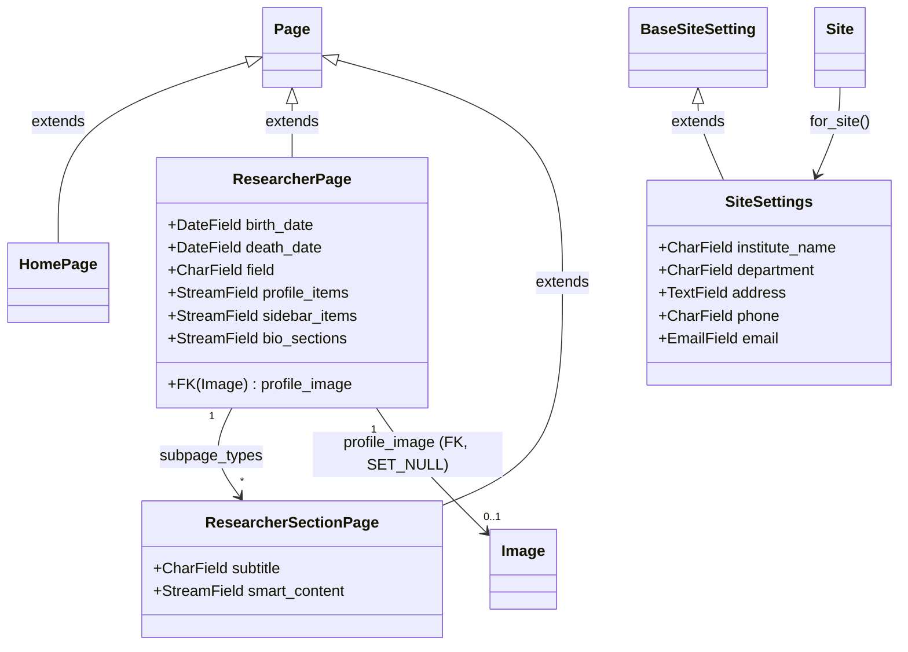

# Models

> **Purpose**: Complete reference for all Django/Wagtail models — ResearcherPage, ResearcherSectionPage, SiteSettings, HomePage — with field definitions, relationships, StreamField composition, API fields, and Wagtail integration.
> **Audience**: Backend developers working with researcher data and StreamField blocks.
> **Prerequisites**: [Wagtail content architecture](../architecture/wagtail-content-architecture.md), [Backend project structure](./project-structure.md).
> **Related**: [Services and utilities](./services-and-utilities.md), [Wagtail configuration](./wagtail-configuration.md).

---

## 1. Model Overview



---

## 2. ResearcherPage

Defined in `backend/researchers/models.py:28-115`.

### Complete Field Reference

| Field | Type | Required | Default | API Field | Content Panel | Notes |
|-------|------|----------|---------|-----------|---------------|-------|
| `title` | CharField (Page) | Yes | — | Yes (inherited) | Yes (Page.content_panels) | Researcher's display name |
| `birth_date` | DateField | No | null | Yes | Yes (SelectDateWidget) | Years: current year down to 1900 |
| `death_date` | DateField | No | null | Yes | Yes (SelectDateWidget) | Years: current year down to 1900 |
| `field` | CharField(max_length=255) | Form-required | — | Yes | Yes | Research field/discipline |
| `profile_image` | FK(Image, SET_NULL) | No | null | Yes (ImageRenditionField) | Yes | max-900x900 rendition |
| `profile_items` | StreamField | No | [] | Yes | Yes | Label/value StructBlock pairs |
| `sidebar_items` | StreamField | No | [] | Yes | Yes | SidebarItemBlock stream |
| `bio_sections` | StreamField | No | [] | Yes | Yes | BiographySectionBlock stream |

### Page Configuration

```python
# models.py:28-34
class ResearcherPage(Page):
    template = "researchers/researcherpage.html"
    subpage_types = ["researchers.ResearcherSectionPage"]

    search_fields = Page.search_fields + [
        index.SearchField("title"),
    ]
```

- `template = "researchers/researcherpage.html"` — Wagtail preview template (see [Wagtail configuration](./wagtail-configuration.md#5-preview-template))
- `subpage_types = ["researchers.ResearcherSectionPage"]` — only section pages allowed as children
- `search_fields = Page.search_fields + [SearchField("title")]` — Wagtail database search on title only

### StreamField Details

**`profile_items`** (`models.py:49-64`):

StreamField of inline `StructBlock` with `label: CharBlock` + `value: CharBlock`. Uses `use_json_field=True`, `blank=True`. Help text: "Add rows like Born, Field, Institution. You can add, reorder, or remove items."

```python
profile_items = StreamField(
    [
        (
            "profile_item",
            blocks.StructBlock(
                [
                    ("label", blocks.CharBlock()),
                    ("value", blocks.CharBlock()),
                ]
            ),
        ),
    ],
    use_json_field=True,
    blank=True,
    help_text="Add rows like Born, Field, Institution. You can add, reorder, or remove items.",
)
```

**`sidebar_items`** (`models.py:66-73`):

StreamField of `SidebarItemBlock`. Uses `use_json_field=True`, `blank=True`. Help text: "Add and reorder sidebar navigation items and their content."

`SidebarItemBlock` (defined in `blocks.py:202-220`) contains: `title`, `subtitle`, `slug`, `items` (ListBlock of `SidebarContentItemBlock`), `smart_content` (StreamBlock with 5 block types). See [Wagtail content architecture](../architecture/wagtail-content-architecture.md) for full block definitions.

**`bio_sections`** (`models.py:75-82`):

StreamField of `BiographySectionBlock`. Uses `use_json_field=True`, `blank=True`. Help text: "Add and reorder biography sections for center content."

`BiographySectionBlock` (defined in `blocks.py:76-86`) contains: `title: CharBlock(required=True)`, `content: RichTextBlock(required=True)` with `RICH_TEXT_FEATURES`.

### API Fields

From `models.py:104-115`:

```python
api_fields = [
    APIField("field"),
    APIField("birth_date"),
    APIField("death_date"),
    APIField(
        "profile_image",
        serializer=ImageRenditionField("max-900x900"),
    ),
    APIField("profile_items"),
    APIField("sidebar_items"),
    APIField("bio_sections"),
]
```

The `profile_image` field uses `ImageRenditionField("max-900x900")` which serializes to a rendition URL rather than the raw image object. This is exposed via Wagtail's v2 Pages API at `/api/v2/pages/`.

### Content Panels

From `models.py:84-102`:

```python
content_panels = Page.content_panels + [
    FieldPanel(
        "birth_date",
        widget=forms.SelectDateWidget(
            years=range(date.today().year, 1899, -1)
        ),
    ),
    FieldPanel(
        "death_date",
        widget=forms.SelectDateWidget(
            years=range(date.today().year, 1899, -1)
        ),
    ),
    FieldPanel("field"),
    FieldPanel("profile_image"),
    FieldPanel("profile_items"),
    FieldPanel("sidebar_items"),
    FieldPanel("bio_sections"),
]
```

All 7 fields appear in the Wagtail admin editor. Birth/death dates use `SelectDateWidget` with a year range from current year down to 1900, preventing unlikely future dates.

---

## 3. ResearcherSectionPage

Defined in `models.py:119-145`.

### Complete Field Reference

| Field | Type | Required | Default | API Field | Notes |
|-------|------|----------|---------|-----------|-------|
| `title` | CharField (Page) | Yes | — | Yes (inherited) | Section name |
| `subtitle` | CharField(max_length=255) | No | "" | Yes | Optional display subtitle |
| `smart_content` | StreamField | No | [] | Yes | 5 block types in StreamField |

### Page Configuration

```python
# models.py:119-122
class ResearcherSectionPage(Page):
    parent_page_types = ["researchers.ResearcherPage"]
    subpage_types = []
```

- `parent_page_types = ["researchers.ResearcherPage"]` — must be child of ResearcherPage
- `subpage_types = []` — no children allowed (leaf node)

### StreamField Details

**`smart_content`** (`models.py:125-135`):

```python
smart_content = StreamField(
    [
        ("publication", PublicationBlock()),
        ("guidance", GuidanceBlock()),
        ("news", NewsClippingBlock()),
        ("supervision", StudentSupervisionBlock()),
        ("gallery", GalleryBlock()),
    ],
    use_json_field=True,
    blank=True,
)
```

Five block types available, matching the same 5 types in `SidebarItemBlock.smart_content` (defined in `blocks.py:207-216`). This duplication is intentional — content can live either inline in sidebar items or on dedicated section pages. See [Wagtail content architecture](../architecture/wagtail-content-architecture.md) for full block field definitions.

### API Fields

From `models.py:142-145`:

```python
api_fields = [
    APIField("subtitle"),
    APIField("smart_content"),
]
```

### Content Panels

From `models.py:137-140`:

```python
content_panels = Page.content_panels + [
    FieldPanel("subtitle"),
    FieldPanel("smart_content"),
]
```

---

## 4. SiteSettings

Defined in `models.py:148-162`.

```python
@register_setting
class SiteSettings(BaseSiteSetting):
    institute_name = models.CharField(max_length=255)
    department = models.CharField(max_length=255)
    address = models.TextField()
    phone = models.CharField(max_length=50)
    email = models.EmailField()

    panels = [
        FieldPanel("institute_name"),
        FieldPanel("department"),
        FieldPanel("address"),
        FieldPanel("phone"),
        FieldPanel("email"),
    ]
```

Registered via `@register_setting` decorator from `wagtail.contrib.settings.models`. One instance per Wagtail `Site` object, accessible via `SiteSettings.for_site(site)`.

### Field Reference

| Field | Type | Description |
|-------|------|-------------|
| `institute_name` | CharField(max_length=255) | Institute display name |
| `department` | CharField(max_length=255) | Department name |
| `address` | TextField | Physical address |
| `phone` | CharField(max_length=50) | Contact phone |
| `email` | EmailField | Contact email |

All 5 fields have corresponding `FieldPanel` entries. Accessible at Wagtail Settings → Site Settings (`/admin/settings/researchers/sitesettings/`).

### Seeded Defaults

From `researchers/management/commands/seed_sitesettings.py` (29 lines):

| Field | Seeded Value |
|-------|-------------|
| `institute_name` | `"RAMAN RESEARCH INSTITUTE"` |
| `department` | `"LIBRARY"` |
| `address` | `"C. V. Raman Avenue, Bangalore - 560080, India"` |
| `phone` | `"(080) 23610122"` |
| `email` | `"library@rri.res.in"` |

Run with `python manage.py seed_sitesettings`. Uses `get_or_create` — does not overwrite existing settings.

### API Endpoint

Served by `researchers/views.py:68-99` at `GET /api/site-settings/` (with 300s cache). Uses `Site.find_for_request(request)` to resolve the correct Site, falling back to `Site.objects.first()`.

---

## 5. HomePage

Defined in `backend/home/models.py` (7 lines):

```python
from django.db import models

from wagtail.models import Page


class HomePage(Page):
    pass
```

Simple `Page` subclass with no additional fields or panels. Uses `pass` body — all behavior inherited from `wagtail.models.Page`.

### Creation

Created by data migration `home/migrations/0002_create_homepage.py`:

- Deletes the default Wagtail Page at slug `"home"`, depth 2 (created by `wagtailcore.0002_initial_data`)
- Creates `HomePage` with:
  - `title = "Home"`, `slug = "home"`
  - `path = "00010001"`, `depth = 2`, `numchild = 0`
  - `url_path = "/home/"`
- Creates a `Site` object: `hostname = "localhost"`, `root_page = homepage`, `is_default_site = True`

This ensures the Wagtail page tree is rooted at the correct HomePage instance.

---

## 6. StreamField Block Types

All 12 StreamField blocks are defined in `backend/researchers/blocks.py` (220 lines). Full field definitions and block hierarchy are documented in [Wagtail content architecture](../architecture/wagtail-content-architecture.md).

The blocks file also defines the shared rich text feature set (`blocks.py:5-15`):

```python
RICH_TEXT_FEATURES = [
    "bold",
    "italic",
    "underline",
    "link",
    "ol",
    "ul",
    "h2",
    "h3",
    "h4",
]
```

The `underline` feature requires the custom Draftail hook in `wagtail_hooks.py` (`researchers/wagtail_hooks.py:6-33`) — see [Wagtail configuration](./wagtail-configuration.md#2-wagtail-hooks).

### Block Summary

| Block Class | lines | Used In | Fields |
|-------------|-------|---------|--------|
| `RenditionImageChooserBlock` | 18-21 | — | Compatibility shim (historical migrations) |
| `TextBlock` | 23-25 | — | Compatibility shim (historical migrations) |
| `SectionItemBlock` | 28-38 | — | Deprecated (was used in previous field architecture) |
| `SectionBlock` | 39-59 | — | Deprecated (was used in previous field architecture) |
| `SidebarContentItemBlock` | 61-73 | SidebarItemBlock.items | title, link, tag, meta_text, description |
| `BiographySectionBlock` | 76-86 | ResearcherPage.bio_sections | title, content |
| `PublicationBlock` | 88-97 | smart_content | title, journal, year, link |
| `GuidanceBlock` | 99-108 | smart_content | student_name, thesis_title, year, link |
| `NewsClippingBlock` | 110-118 | smart_content | headline, source, date, link |
| `StudentSupervisionBlock` | 121-128 | smart_content | student, topic, year |
| `GalleryImageItemBlock` | 131-188 | GalleryBlock.images | image, caption, about_image |
| `GalleryBlock` | 190-199 | smart_content | title, images |
| `SidebarItemBlock` | 202-220 | ResearcherPage.sidebar_items | title, subtitle, slug, items, smart_content |

`GalleryImageItemBlock` includes backward-compatible `to_python()` and `bulk_to_python()` methods (`blocks.py:140-183`) that normalize legacy image-only entries (stored as raw IDs or dicts without the `image` key) into the current struct format.

---

## 7. Model Relationships in the Wagtail Page Tree

Wagtail uses `django-treebeard` Materialized Path for page trees:

- All pages stored in `wagtailcore_page` table
- `content_type_id` + `page_ptr` (OneToOneField) differentiates page types
- `ResearcherSectionPage` must be descendant of `ResearcherPage` (enforced by `parent_page_types`)
- The page tree is: HomePage → ResearcherPage(s) → ResearcherSectionPage(s)

Page type constraints are enforced at two levels:
1. **Wagtail admin UI**: `subpage_types` / `parent_page_types` limit available page types in the "Add child page" menu
2. **django-treebeard**: Underlying tree storage tracks parent-child relationships via `path` field (Materialized Path algorithm)

---

## 8. Publishing and API Visibility

- Only `.live().public()` pages appear in API responses — enforced by all service functions and API views (e.g., `archive_service.py:104-108`, `archive_service.py:141-148`, `archive_service.py:222-224`)
- Draft pages are invisible to both Wagtail v2 Pages API and custom endpoints
- The frontend's `fetch()` calls receive only published content
- Wagtail's `expire_at`/`go_live_at` scheduling fields are available on all Page subclasses but not currently used in any page type

---

## 9. Future Refactoring Opportunities

1. **Add model docstrings**: No model class or method has docstrings. Document the purpose of each page type (`models.py:28`, `models.py:119`, `models.py:148`).
2. **Add help_text to all fields**: Only StreamFields have help_text currently. Profile fields like `field` (`models.py:39`) would benefit from editor guidance.
3. **Consider adding `expire_at`/`go_live_at` to ResearcherPage**: Useful for time-sensitive content like news sections. Currently both are inherited from `Page` but not surfaced in content panels.
4. **Review `related_name="+"` on profile_image** (`models.py:46`): The `+` suppresses reverse relation. Verify this is intentional — it prevents querying "all pages using this image" via `image.researcherpage_set`.
5. **Remove deprecated blocks**: `RenditionImageChooserBlock` (`blocks.py:18-21`), `TextBlock` (`blocks.py:23-25`), `SectionItemBlock` (`blocks.py:28-38`), and `SectionBlock` (`blocks.py:39-59`) exist only as compatibility shims for historical migrations. Verify they are no longer referenced before removal.
