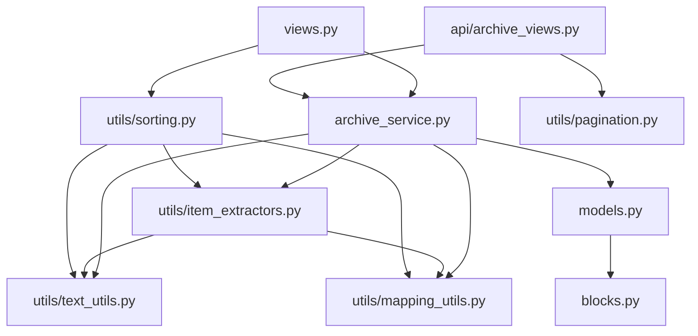

> **Purpose**: Complete annotated directory structure of the Django backend, with app responsibilities, layer boundaries, import rules, and dependency graph.
> **Audience**: Backend developers new to the project.
> **Prerequisites**: [System overview](../architecture/system-overview.md), [Wagtail content architecture](../architecture/wagtail-content-architecture.md).
> **Related**: [Backend README (quick-start)](../../backend/README.md), [Models](./models.md), [Services and utilities](./services-and-utilities.md).

---

## 1. Annotated Directory Tree

```
backend/                              # Django 5.2 + Wagtail 7.4 project
├── manage.py                         # Django management entry point — defaults to backend.settings.dev
├── requirements.txt                  # 43 Python dependencies (Django 5.2.14, Wagtail 7.4, gunicorn, etc.)
├── .env                              # Active environment variables (gitignored)
├── .env.example                      # Environment variable template (39 lines)
├── .dockerignore                     # Docker build exclusions (leftover from removed Docker setup)
│
├── backend/                          # Django project configuration
│   ├── __init__.py
│   ├── settings/
│   │   ├── __init__.py               # Empty — package marker
│   │   ├── base.py                   # Shared settings: ALL INSTALLED_APPS, MIDDLEWARE, DB config, cache, logging (318 lines)
│   │   ├── dev.py                    # Development settings: DEBUG=True, CORS for localhost:3000 (43 lines)
│   │   └── production.py             # Production settings: enforces DATABASE_URL, SECRET_KEY, ALLOWED_HOSTS; HSTS, SSL (56 lines)
│   ├── urls.py                       # Root URL config: Wagtail v2 API router + 7 custom endpoints + Wagtail admin + Django admin (70 lines)
│   ├── wsgi.py                       # Gunicorn WSGI entry point
│   ├── middleware.py                  # ApiSecurityHeadersMiddleware — CSP/Permissions-Policy for API routes (23 lines)
│   ├── static/
│   │   ├── css/backend.css           # Empty placeholder
│   │   └── js/backend.js             # Empty placeholder
│   └── templates/
│       ├── base.html                 # Base HTML5 template with Wagtail userbar, static assets
│       ├── 404.html                  # Custom 404 page
│       └── 500.html                  # Custom 500 page
│
├── researchers/                      # MAIN APPLICATION — researcher profiles, content blocks, API
│   ├── __init__.py
│   ├── apps.py                       # Django AppConfig (ResearchersConfig)
│   ├── admin.py                      # Empty — models registered via Wagtail's page system, not Django admin
│   ├── models.py                     # ResearcherPage, ResearcherSectionPage, SiteSettings (162 lines)
│   ├── blocks.py                     # 12 StreamField block definitions + RICH_TEXT_FEATURES constant (220 lines)
│   ├── views.py                      # 3 thin views: image_detail, site_settings_detail, researcher_section_filtered_items (99 lines)
│   ├── wagtail_hooks.py              # Draftail underline feature registration (33 lines)
│   │
│   ├── api/                          # API view layer
│   │   ├── __init__.py
│   │   └── archive_views.py           # 4 paginated endpoints (publications, guidance, news, section count) + helpers (149 lines)
│   │
│   ├── services/                     # Business logic layer
│   │   ├── __init__.py
│   │   └── archive_service.py         # extract_and_filter_by_type, build_section_items, filter_items, build_items_from_blocks (234 lines)
│   │
│   ├── utils/                        # Pure utility functions
│   │   ├── __init__.py
│   │   ├── text_utils.py             # to_plain_text, to_section_slug, extract_labeled_segment (32 lines)
│   │   ├── mapping_utils.py          # normalize_mapping, get_mapping_value — safe dict/attribute access (32 lines)
│   │   ├── item_extractors.py        # get_author, get_journal, get_year (55 lines)
│   │   ├── sorting.py                # sort_results — 7 sort modes (28 lines)
│   │   └── pagination.py             # paginate_items — limit/offset slicing (12 lines)
│   │
│   ├── tests/                        # 43 tests across 5 files
│   │   ├── __init__.py
│   │   ├── test_pagination.py        # 6 tests — pagination logic
│   │   ├── test_filtering.py         # 13 tests — search, year filter, sort modes
│   │   ├── test_archive_service.py   # 7 tests — block extraction, service orchestration
│   │   ├── test_archive_views.py     # 6 tests — view responses, error handling
│   │   └── test_edge_cases.py        # 11 tests — invalid params, malformed data
│   │
│   ├── management/
│   │   ├── __init__.py
│   │   └── commands/
│   │       ├── __init__.py
│   │       └── seed_sitesettings.py   # Management command: seeds default RRI SiteSettings (29 lines)
│   │
│   ├── migrations/
│   │   ├── __init__.py
│   │   └── 0001_initial.py           # CONSOLIDATED migration — creates all 3 models + all block definitions (62 lines)
│   │
│   └── templates/
│       └── researchers/
│           └── researcherpage.html   # Wagtail preview template — renders profile inline for admin preview
│
├── home/                             # Wagtail home page app
│   ├── __init__.py
│   ├── apps.py                       # Django AppConfig (HomeConfig)
│   ├── models.py                     # HomePage — simple Page subclass with no extra fields
│   ├── tests.py                      # 4 tests — homepage creation and rendering
│   ├── migrations/
│   │   ├── 0001_initial.py           # Creates HomePage model
│   │   └── 0002_create_homepage.py   # Data migration: creates default homepage + Site object
│   └── templates/home/
│       ├── home_page.html            # Home page template
│       └── welcome_page.html         # Default Wagtail welcome screen
│
├── search/                           # Basic search app
│   ├── __init__.py
│   ├── views.py                      # search() — query-based search with pagination
│   └── templates/search/
│       └── search.html               # Search form + paginated results template
│
├── media/                            # User-uploaded files (images, documents)
│   └── images/                       # Image uploads
│
└── static/                           # Collected static files (collectstatic output)
    ├── admin/                        # Django admin static assets
    ├── css/                          # Project CSS
    └── wagtailadmin/                 # Wagtail admin JS/CSS bundles
```

## 2. Layer Architecture

The `researchers/` app follows a strict four-layer architecture with unidirectional dependency flow:

```
utils → services → api → views
```

| Layer | Directory | Responsibility | Imports From |
|-------|-----------|---------------|-------------|
| Utils | `researchers/utils/` | Pure functions — no Django imports | Standard library only |
| Services | `researchers/services/` | Business logic — extract/filter/sort items | Utils, Models |
| API Views | `researchers/api/` | HTTP handling — request parsing, response formatting | Services, Utils |
| Thin Views | `researchers/views.py` | Legacy thin views — delegate to services | Services |

**Import rules:**
- Utils must NOT import from services, api, or models
- Services may import from utils and models, but NOT from api or views
- API views may import from services and utils, but NOT from other api modules
- No circular imports (enforced by this strict hierarchy)

## 3. App Responsibilities

| App | Package | Responsibilities |
|-----|---------|-----------------|
| **researchers** | `researchers/` | Researcher profiles, StreamField blocks, custom API, archive service, tests, management commands |
| **home** | `home/` | Wagtail home page at root URL (`/`). Simple Page subclass — no custom fields. Data migration creates default homepage. |
| **search** | `search/` | Basic Wagtail search at `/search/`. Not used by the frontend (which uses custom API endpoints). |
| **backend** | `backend/` | Django project config: settings (base/dev/production), URL routing, WSGI, middleware, templates |

## 4. Dependency Graph



## 5. Requirements Summary

From `backend/requirements.txt` (43 packages):

| Category | Packages | Purpose |
|----------|----------|---------|
| Core framework | Django 5.2.14, djangorestframework 3.17.1 | Web framework + REST API toolkit |
| CMS | wagtail 7.4 | Content management with StreamField |
| Database | dj-database-url 2.3.0, mysqlclient 2.2.7 | Connection string parsing + MariaDB driver |
| CORS | django-cors-headers 4.9.0 | Cross-origin request support |
| Filtering | django-filter 24.3 | Queryset filtering (Wagtail dependency) |
| Cache | redis 5.3.1 | Production cache backend |
| WSGI | gunicorn 22.0.0 | Production WSGI HTTP server |
| Image processing | pillow 11.3.0, pillow_heif 1.3.0 | Image handling + HEIF support |
| Environment | python-dotenv 1.2.2 | .env file loading |
| Wagtail deps | modelcluster, taggit, treebeard, tasks, permissionedforms, Willow, draftjs_exporter, telepath, laces | Wagtail internal dependencies |
| Utilities | requests, beautifulsoup4, openpyxl, PyJWT, defusedxml, filetype, anyascii, l18n, six, packaging | Various utilities used directly or by Wagtail |

## 6. Extension Points

Where to add new functionality:

| Goal | Add Code In |
|------|------------|
| New StreamField block type | `researchers/blocks.py` — define new block class; `researchers/models.py` — add to StreamField; **RUN MIGRATIONS** |
| New API endpoint | `researchers/api/` — new view function; `backend/urls.py` — add URL pattern |
| New service function | `researchers/services/archive_service.py` — add function; import in view |
| New utility | `researchers/utils/` — new module; import in service |
| New management command | `researchers/management/commands/` — new file with Command class |
| New Wagtail hook | `researchers/wagtail_hooks.py` — register new hook |
| New field on existing page | `researchers/models.py` — add field + content_panel + api_field; **RUN MIGRATIONS** |

## 7. Future Refactoring Opportunities

1. **Remove dead filtered-items endpoint**: `views.py:15-41` and `urls.py:31-34` — endpoint not consumed by frontend. Remove after verifying no external consumers.
2. **Extract GalleryImageItemBlock compat layer**: `blocks.py:140-183` — `to_python()`/`bulk_to_python()` backward compatibility can be removed once all legacy data has been migrated.
3. **Add models.py docstrings**: `models.py` has no docstrings on any class or method.
4. **Consolidate helper functions**: `_parse_pagination_params` and `_get_researcher_page` in `archive_views.py` are reused across 4 views — consider extracting to a shared module.
5. **Remove compatibility shims**: `RenditionImageChooserBlock` and `TextBlock` in `blocks.py:18-25` are documented as "compatibility shim for historical migrations" — verify they are still needed after migration consolidation.
