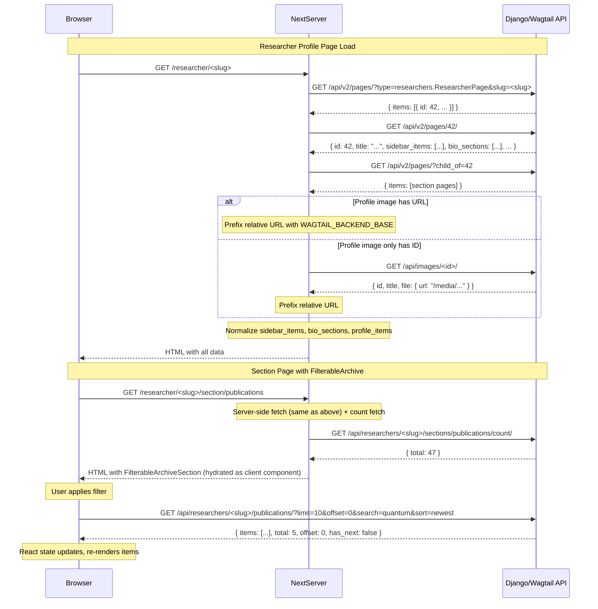

# API Integration

> **Purpose**: Complete reference for how the Next.js frontend consumes the Django/Wagtail backend API — data fetching patterns, normalization layer, image URL resolution, and API client architecture.
> **Audience**: Frontend developers integrating with the backend API.
> **Prerequisites**: [API endpoints reference](../api/endpoints.md), [Architecture](./architecture.md).
> **Related**: [Data flow](../architecture/data-flow.md), [Rendering flow](./rendering-flow.md).

## 1. API Client Architecture

The API integration follows a 3-layer architecture:

```
Config Layer: app/lib/config.js
  ├── getWagtailBackendBaseUrl()     → "http://127.0.0.1:8000" (or env override)
  └── getWagtailPagesApiUrl()        → "http://127.0.0.1:8000/api/v2/pages/"

API Clients:
  ├── app/lib/wagtailApi.js          → fetchImageDetails(id), fetchImageDetailsBatch(ids)
  └── app/lib/siteSettingsApi.js     → getSiteSettings() with ISR

Data Normalization:
  └── app/researcher/[slug]/researcherApi.js
       ├── getResearcherPageBySlugResult(slug)        → {researcher, sectionPages, hasError}
       ├── getResearcherSectionPages(researcherId)    → section page array
       ├── getResearcherSectionPageBySlug(id, slug)   → single section page
       ├── getSidebarItems(sidebarItems)              → normalized sidebar array
       ├── getSidebarItemsFromSectionPages(pages)     → derived sidebar from child pages
       ├── getBiographySections(bioSections)          → bio section array
       ├── getProfileItems(profileItems, limit=20)    → label/value pair array
       ├── getResearcherProfileImageUrl(researcher)   → resolved image URL
       └── getResearcherGalleryImages(researcher, pages) → resolved gallery images
```

The `WAGTAIL_BACKEND_BASE` constant is resolved once at module load time from `NEXT_PUBLIC_WAGTAIL_BASE_URL` (defaults to `http://127.0.0.1:8000`). The config layer normalizes the URL by stripping trailing slashes (`/\/+$/`).

## 2. Wagtail Pages API Integration

### Two-Step Fetch Pattern

`getResearcherPageBySlugResult(slug)` uses a two-step approach because Wagtail's Pages API v2 does not support fetching a page detail by slug directly:

1. **List by slug**: `GET /api/v2/pages/?type=researchers.ResearcherPage&slug=<slug>` — fetches the page list filtered by type and slug
2. **Detail by ID**: `GET /api/v2/pages/<id>/` — fetches the full detail from the matched item's ID

```javascript
// researcherApi.js:93-128
export async function getResearcherPageBySlugResult(slug) {
  // Step 1: List with type + slug filter
  const listResponse = await fetch(
    `${WAGTAIL_PAGES_API}?type=researchers.ResearcherPage&slug=${slug}`,
    { cache: "no-store" }
  );
  const listData = await listResponse.json();
  const matchedPage = listData?.items?.[0];

  // Step 2: Detail by ID
  const detailResponse = await fetch(`${WAGTAIL_PAGES_API}${matchedPage.id}/`, { cache: "no-store" });
  const researcher = await detailResponse.json();

  const sectionPages = await getResearcherSectionPages(matchedPage.id);
  return { researcher, sectionPages, hasError: false };
}
```

### Section Page Fetching

**`getResearcherSectionPages(researcherId)`** fetches all child pages of a researcher page:
- Calls `GET /api/v2/pages/?child_of=<researcherId>` with `{ cache: "no-store" }`
- Filters results to only pages where `meta.type === "researchers.ResearcherSectionPage"`
- Returns an empty array on error (swallows errors, logs to console)

**`getResearcherSectionPageBySlug(researcherId, sectionSlug)`** fetches a specific section page:
- Calls `getResearcherSectionPages()` to get all children
- Matches by normalized slug using `toSectionSlug()` (lowercase, strip non-alphanumeric, spaces→hyphens)
- Fetches detail from `GET /api/v2/pages/<matchedSection.id>/` with `{ cache: "no-store" }`

### Why `{ cache: "no-store" }`

All Wagtail Pages API requests use `{ cache: "no-store" }` because CMS content can change at any time through Wagtail admin. Editors publish pages, and the frontend must reflect changes immediately. No revalidation period is acceptable for content pages.

### StreamField Block Structure

Wagtail StreamField data arrives as arrays of `{type, value, id}` objects:

```json
{
  "sidebar_items": [
    {
      "type": "sidebar_item",
      "value": {
        "title": "Publications",
        "slug": "publications",
        "smart_content": [
          { "type": "publication", "value": { "title": "...", "journal": "...", ... } },
          { "type": "guidance", "value": { "student_name": "...", ... } }
        ],
        "items": [...]
      },
      "id": "abc123"
    }
  ]
}
```

The normalization layer in `researcherApi.js` unwraps this nested structure, accessing `block.value` to extract the actual field data.

### Page Type Detection

The `getPageType()` helper normalizes type access across API response shapes:

```javascript
function getPageType(page) {
  return page?.meta?.type || page?.type;
}
```

## 3. Data Normalization Layer

### `getSidebarItems(sidebarItems)`

**Input**: Raw StreamField `sidebar_items` array from the researcher API response (array of `{type, value, id}` blocks).  
**Output**: Array of normalized sidebar objects with this shape:

```javascript
{
  title: string,           // Section title (e.g., "Publications")
  subtitle: string,        // Section subtitle
  slug: string,            // URL-safe slug via toSectionSlug()
  items: [                 // List of sidebar list items
    {
      title: string,
      link: string,
      tag: string,
      meta_text: string,
      description: string
    }
  ],
  smart_content: [...]     // Raw smart_content blocks array (preserved for later rendering)
}
```

**Normalization steps**:
1. Each block's `value` is unwrapped (handles both `block.value` and direct value shapes)
2. Title is extracted and slug is derived via `toSectionSlug()` (falls back to title if no slug field)
3. `rawItems` (the items array within the block value) is mapped into flat `{title, link, tag, meta_text, description}` objects
4. `smart_content` is passed through as-is for later processing
5. **Deduplication**: Filtered by slug uniqueness — if two blocks produce the same slug, only the first is kept

### `getSidebarItemsFromSectionPages(sectionPages)`

**Input**: Array of section page objects (from `getResearcherSectionPages()`).  
**Output**: Sidebar items derived from section child pages:

```javascript
{
  title: string,    // page.title
  slug: string,     // toSectionSlug(page.meta.slug)
  subtitle: string  // page.subtitle
}
```

Used as a fallback when StreamField sidebar_items is empty — the sidebar is constructed from the researcher's child page hierarchy.

### `getBiographySections(bioSections)`

**Input**: Raw StreamField `bio_sections` array.  
**Output**: Filtered array of objects with shape:

```javascript
{
  title: string,   // Section title
  content: string, // Rich text HTML
  slug: string     // toSectionSlug(title)
}
```

**Normalization steps**:
1. Filters blocks by `type === "bio_section"` (checks both `block.type` and `block.block_type`)
2. Extracts `title` and `content` from `block.value`
3. Derives `slug` from title
4. Filters out entries where either title or content is empty

### `getProfileItems(profileItems, limit=20)`

**Input**: Raw StreamField `profile_items` array.  
**Output**: Array of `{label, value}` pairs, limited to `limit` entries.

**Normalization steps**:
1. Unwraps each block's `value`
2. Checks both `value.value` and `value.content` for the display value (handles different field names)
3. Filters out entries missing label or value
4. Slices to maximum `limit` entries

### `toSectionSlug(value)`

Utility for normalizing arbitrary strings into URL-safe slugs:

```javascript
export function toSectionSlug(value) {
  return String(value || "")
    .toLowerCase()
    .trim()
    .replace(/[^a-z0-9\s-]/g, "")   // Remove special characters
    .replace(/\s+/g, "-")            // Spaces → hyphens
    .replace(/-+/g, "-");            // Collapse multiple hyphens
}
```

### Deduplication Patterns

Two distinct deduplication strategies are used:

1. **Sidebar items**: Deduplicated by `slug` — each normalized sidebar item is kept only if its slug has not appeared earlier in the array
2. **Gallery images**: Deduplicated by both `url` AND `id` — an image is considered a duplicate if it shares either the same resolved URL or the same image ID as a previously kept image

## 4. Image URL Resolution

### The Full Pipeline

Wagtail's API can return images in several formats. The frontend must handle:

1. **Direct absolute URL**: `imageValue.url` starts with `http://` or `https://` — used as-is
2. **Relative URL**: `imageValue.url` starts with `/` (e.g., `/media/images/photo.jpg`) — prefixed with `WAGTAIL_BACKEND_BASE`
3. **Nested file URL**: `imageValue.file.url` — same prefixing logic
4. **Download URL**: `imageValue.meta.download_url` — same prefixing logic
5. **Numeric ID**: `imageValue` is a plain number (image ID) — resolved via `fetchImageDetails()`
6. **Object with ID**: `imageValue.id` exists — resolved via `fetchImageDetails()`

### `getResearcherProfileImageUrl(researcher)`

```javascript
export async function getResearcherProfileImageUrl(researcher) {
  // Step 1: Try direct URL (checks multiple field paths)
  let profileImageUrl =
    researcher.profile_image?.url ||
    researcher.profile_image?.meta?.download_url ||
    researcher.profile_image?.file ||
    researcher.profile_image?.file?.url ||
    null;

  // Step 2: Prefix relative URLs
  if (typeof profileImageUrl === "string" && profileImageUrl.startsWith("/")) {
    profileImageUrl = `${WAGTAIL_BACKEND_BASE}${profileImageUrl}`;
  }

  // Step 3: Fallback to API fetch by ID
  if (!profileImageUrl && researcher.profile_image?.id) {
    const profileImage = await fetchImageDetails(researcher.profile_image.id);
    profileImageUrl = profileImage?.file?.url || null;
  }

  return profileImageUrl;
}
```

### `resolveGalleryImageEntry(entry, index)`

Gallery images face the most complex resolution due to multiple nesting formats:

```javascript
async function resolveGalleryImageEntry(entry, index = 0) {
  const value = entry?.value || entry || {};
  const imageValue = value?.image || value;

  // Try all possible URL fields
  let imageUrl =
    imageValue?.url ||
    imageValue?.file?.url ||
    imageValue?.meta?.download_url ||
    value?.url ||
    value?.file?.url ||
    value?.meta?.download_url ||
    "";

  // Prefix relative URLs
  if (typeof imageUrl === "string" && imageUrl.startsWith("/")) {
    imageUrl = `${WAGTAIL_BACKEND_BASE}${imageUrl}`;
  }

  // Determine image ID for API fallback
  let imageId = null;
  if (typeof imageValue === "number") imageId = imageValue;
  else if (imageValue?.id) imageId = imageValue.id;
  else if (value?.id) imageId = value.id;

  // Fallback to API fetch by ID
  if (!imageUrl && imageId) {
    const imageDetails = await fetchImageDetails(imageId);
    imageUrl = imageDetails?.file?.url || imageDetails?.url || ...;
    if (typeof imageUrl === "string" && imageUrl.startsWith("/")) {
      imageUrl = `${WAGTAIL_BACKEND_BASE}${imageUrl}`;
    }
  }

  return { id: imageId, url: imageUrl, title, caption, aboutImageHtml, alt };
}
```

### `fetchImageDetails(imageId)` and `fetchImageDetailsBatch(imageIds)`

Located in `app/lib/wagtailApi.js`:

```javascript
export async function fetchImageDetails(imageId) {
  const response = await fetch(
    `${WAGTAIL_BACKEND_BASE}/api/images/${imageId}/`,
    { cache: "no-store" }
  );
  const imageData = await response.json();

  // Prefix relative URLs in the response
  if (imageData?.file?.url?.startsWith("/")) {
    imageData.file.url = `${WAGTAIL_BACKEND_BASE}${imageData.file.url}`;
  }
  return imageData;
}

export async function fetchImageDetailsBatch(imageIds) {
  const promises = imageIds.map((id) => fetchImageDetails(id));
  const results = await Promise.all(promises);
  return results.filter((img) => img !== null);
}
```

### `next.config.mjs` Image Optimization

The `next/image` component can only optimize images from configured `remotePatterns`:

```javascript
images: {
  remotePatterns: [
    { protocol: "http", hostname: "127.0.0.1", port: "8000", pathname: "/media/**" },
    { protocol: "http", hostname: "localhost", port: "8000", pathname: "/media/**" },
  ],
}
```

Note: Production deployments must add their actual backend hostname. HTTPS is not yet configured.

## 5. Site Settings Integration

`getSiteSettings()` fetches institute configuration with ISR caching:

```javascript
export async function getSiteSettings() {
  const response = await fetch(`${WAGTAIL_BACKEND_BASE}/api/site-settings/`, {
    next: { revalidate: 300 },  // 5-minute ISR
  });

  return {
    institute_name: data?.institute_name || "",
    department:     data?.department || "",
    address:        data?.address || "",
    phone:          data?.phone || "",
    email:          data?.email || "",
  };
}
```

Called from `app/layout.js` (the root Server Component) on every page load. The 5-minute revalidation means site settings changes in Wagtail admin will be reflected within 5 minutes. On fetch failure, all fields default to empty strings — the site continues to render without settings-dependent content.

## 6. Client-Side API Consumption

### FilterableArchiveSection Pattern

The `FilterableArchiveSection` component (201 lines, `components/archive/FilterableArchiveSection.jsx`) is the only client-side API consumer. It demonstrates the full client-side fetching pattern:

**State management** (7 state variables):
```javascript
const [items, setItems]             = useState([]);     // Current page items
const [total, setTotal]             = useState(0);      // Total item count
const [offset, setOffset]           = useState(0);      // Current pagination offset
const [hasNext, setHasNext]         = useState(false);  // Next page available
const [hasPrevious, setHasPrevious] = useState(false);  // Previous page available
const [isLoading, setIsLoading]     = useState(false);  // Loading state
const [error, setError]             = useState(null);   // Error message

// Separate draft state for filter inputs (not applied until user clicks "Apply")
const [draftSearchTerm, setDraftSearchTerm] = useState("");
const [draftSortOption, setDraftSortOption] = useState("title_asc");
const [draftYear, setDraftYear]             = useState("");
```

**Endpoint**: `GET /api/researchers/<slug>/<sectionType>/?limit=10&offset=N&search=&sort=&year=`

**Pagination**: Limited to 10 items per page (`PAGE_SIZE = 10`), offset-based. Previous/Next buttons with disabled states.

**Filter reset behavior**: Resets offset to 0 when filters change.

**Error state**: Shows "Failed to load items" with a "Try again" retry button that re-fetches with current parameters.

**Empty state differentiation**:
- `isNoItemsAtAll` (total === 0, no active filters): "No items available in this section."
- `isNoMatchAfterFilter` (total > 0 but no matching items): "No items match your filters."

**Loading skeleton**: Animated pulse placeholders — 10 cards matching the PAGE_SIZE.

### `ArchiveFilterPanel`

The filter panel (98 lines, `components/ArchiveFilterPanel.jsx`) provides:

- **Search input**: Text search across title, author, or journal (placeholder: "Search title, author, or journal")
- **Sort dropdown**: 7 options (Title A-Z, Title Z-A, Author A-Z, Author Z-A, Journal A-Z, Newest First, Oldest First)
- **Year input**: Numeric input, min 1800, max 2100
- **Apply/Reset buttons**: Filters only apply on click, not on keystroke
- **Mobile toggle**: Collapsed by default on mobile, "Filter Results" button to expand

## 7. API Request Flow Diagram



## 8. Known Issues

- **No request deduplication**: Client-side fetches in `FilterableArchiveSection` do not cache results. Every filter change or pagination action triggers a new network request, even for previously fetched pages.
- **No retry logic for transient failures**: Only a manual "Try again" button. No `AbortController` for cancelling in-flight requests when user navigates away or changes filters rapidly.
- **Image URL prefixing breaks if backend migrates to CDN**: The prefixing logic in `fetchImageDetails()` and `resolveGalleryImageEntry()` assumes all relative URLs need backend prefix. If assets move to a CDN, the absolute URL from Wagtail would need different handling.
- **`researcherApi.js` is monolithic**: 395 lines covering fetching, normalization, image resolution, and slug utilities. No separation of concerns between data fetching and data transformation.
- **Error swallowing**: `getResearcherSectionPages()` and `fetchImageDetails()` log errors to console but return empty/null — the caller cannot distinguish "no data" from "fetch failed".
- **No TypeScript**: API response shapes are not typed. Field name typos in normalization code (e.g., `block.value.smart_content` vs `block.value.smartContent`) would only be caught at runtime.
