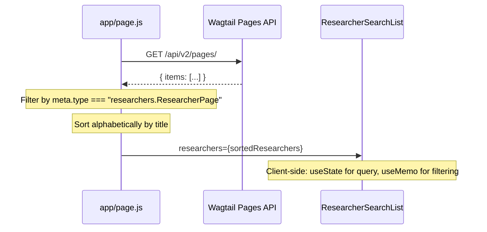

# Rendering Flow

> **Purpose**: Detailed walkthrough of the researcher page rendering lifecycle — from URL navigation through API fetch, data normalization, component tree construction, and final browser render.
> **Audience**: Frontend developers debugging rendering issues or adding new page types.
> **Prerequisites**: [Architecture](./architecture.md), [API integration](./api-integration.md).
> **Related**: [Data flow](../architecture/data-flow.md), [Styling](./styling.md).

## 1. Home Page Rendering

**Route**: `/`  
**File**: `app/page.js` (Server Component)

**Step-by-step flow**:

1. `getResearchers()` is called: `fetch("/api/v2/pages/", { cache: "no-store" })`
2. Response is filtered for `meta.type === "researchers.ResearcherPage"`
3. Results are sorted alphabetically by `title` via `localeCompare()`
4. If `hasError` is true, `<ContentUnavailable />` is rendered
5. If zero researchers, a "No Profiles pages found." message is shown
6. Otherwise, `<ResearcherSearchList>` is rendered with sorted researchers and UI labels



The `ResearcherSearchList` component (client) implements client-side filtering:
- `useState("")` for search query
- `useMemo` to filter researchers where `page.title.toLowerCase().includes(normalizedQuery)`
- Renders count: "Showing N of M Profiles"
- Grid layout: 2 columns on medium screens

## 2. Researcher Profile Rendering

**Route**: `/researcher/<slug>`  
**File**: `app/researcher/[slug]/page.js` (Server Component)

**Complete step-by-step walkthrough**:

### Phase 1: Data Fetching

```
page.js
├── getResearcherPageBySlugResult(slug)
│   ├── Step 1: GET /api/v2/pages/?type=researchers.ResearcherPage&slug=<slug>
│   │   └── Returns: { items: [{ id: 42, title: "..." }] }
│   ├── Step 2: GET /api/v2/pages/42/
│   │   └── Returns: full researcher object with sidebar_items, bio_sections, profile_items
│   └── Step 3: getResearcherSectionPages(42)
│       └── GET /api/v2/pages/?child_of=42
│           └── Returns: [section pages filtered by type]
├── Returns: { researcher, sectionPages, hasError }
```

### Phase 2: Error/Not-Found Handling

- `hasError === true` → renders `<ContentUnavailable />`
- `researcher === null` → renders custom "Researcher Not Found" with link to `/`

### Phase 3: Data Normalization

```
researcher object from API
├── getResearcherProfileImageUrl(researcher)
│   ├── Try direct URL (profile_image.url, profile_image.meta.download_url, etc.)
│   ├── Prefix relative URLs with WAGTAIL_BACKEND_BASE
│   └── Fallback: fetchImageDetails(profile_image.id)
│       └── GET /api/images/<id>/ → extract file.url
├── getSidebarItems(researcher.sidebar_items)
│   ├── Unwrap {type, value, id} blocks
│   ├── Extract title, subtitle, slug, items, smart_content
│   └── Deduplicate by slug
├── buildSidebarSections(sidebarItems) ← page.js internal helper
│   └── Flatten to {title, slug, subtitle}
├── getBiographySections(researcher.bio_sections)
│   ├── Filter blocks by type === "bio_section"
│   └── Extract {title, content, slug}
├── getProfileItems(researcher.profile_items)
│   └── Extract {label, value} pairs, limit 20
└── formatIndianDateRange(researcher.birth_date, researcher.death_date)
    └── Format with en-IN locale → "15 August 1947 – 22 March 2005"
```

### Phase 4: Component Rendering

```
<ResearcherPageLayout>
  ├── Desktop (hidden on mobile): flex layout with 3 sections
  │   ├── <SidebarNavigation>         ← left column, w-52
  │   ├── <article>                    ← center, flex-1
  │   │   ├── <header>
  │   │   │   ├── <h1>{researcher.title}</h1>
  │   │   │   ├── {researcher.field}
  │   │   │   └── {dateText}
  │   │   └── <BiographySections sections={biographySections}>
  │   │       └── For each bio section:
  │   │           ├── <header> with title
  │   │           └── <div dangerouslySetInnerHTML={section.content} />
  │   └── <ProfileCard>               ← right column, w-80
  │       ├── <ProtectedImage src={profileImageUrl} />
  │       └── <dl> with profile items
  │
  └── Mobile (shown on small screens): vertical stack
      ├── <MobileSectionsSidebar>     ← slide-out drawer
      ├── Article content (before profile)
      ├── <ProfileCard>
      ├── <BiographySections>
      └── Article content (after profile, if mobileContentBeforeProfile=false)
```

The `mobileContentBeforeProfile` prop on the researcher page is set to `true`, meaning on mobile: content renders first, then profile card, then bio sections.

## 3. Section Page Rendering

**Route**: `/researcher/<slug>/section/<sectionSlug>`  
**File**: `app/researcher/[slug]/section/[sectionSlug]/page.js` (Server Component, 166 lines)

### Decision Tree

```
Section Page Loads
├── fetch researcher (same as profile page)
├── fetch section page by slug → getResearcherSectionPageBySlug(id, slug)
├── getSidebarItems() from stream fields
├── getSidebarItemsFromSectionPages() from child pages
│   └── Prefer sectionPageSidebarItems over streamSidebarItems
│
├── Find currentStreamSection in streamSidebarItems (by normalized slug)
│
├── try to find SectionPage via getResearcherSectionPageBySlug()
│
├── Determine section blocks:
│   ├── Prefer streamSmartContent (from sidebar_items smart_content)
│   └── Fallback to sectionPageSmartContent (from section page detail)
│
├── hasKnownSection = (currentStreamSection exists || sectionPage exists)
│   └── If false → <ContentUnavailable />
│
├── isFilterTargetSection() check:
│   └── Normalized slug matches: publications, publication, research-guidance, guidance
│   └── If yes → shouldHideProfileCard = true, sectionType determined
│
├── If filter target:
│   ├── Fetch item count: GET /api/researchers/<slug>/sections/<section>/count/ (ISR 5min)
│   └── If count > 0 → render <FilterableArchiveSection>
│       └── Client component: paginated archive with filters
│   └── Profile card is hidden
│
├── If has smart content blocks:
│   └── render <SmartContentRenderer blocks={sectionBlocks}>
│
└── Otherwise:
    └── render <SidebarContentPage items={sectionItems}>
```

### Section Type Detection

`getSectionType()` determines the API path suffix for filterable sections:

```
"publications"          → sectionType = "publications"
"guidance" in slug      → sectionType = "guidance"
"news" in slug          → sectionType = "news"
default                 → sectionType = "publications"
```

### Section Title Resolution

`sectionPage?.subtitle` is preferred over `currentStreamSection?.subtitle` for the section subtitle. The section page's own subtitle field provides the most specific description.

### Conditional Profile Card

The `showDesktopProfileCard` and `showMobileProfileCard` props are set to `!shouldHideProfileCard`. For filter-target sections with item count > 0, the profile card is hidden to make room for the filter panel + results list.

## 4. Gallery Rendering

**Route**: `/researchers/<slug>/gallery`  
**File**: `app/researchers/[slug]/gallery/page.jsx` (Server Component)

### Flow

1. `getResearcherPageBySlugResult(slug)` → fetches researcher + section pages
2. If error or no researcher → `notFound()` (Next.js 404)
3. `getResearcherGalleryImages(researcher, sectionPages)`:
   - Extract sidebar items from researcher
   - For each sidebar item with `smart_content`, extract gallery blocks
   - Filter blocks by `type === "gallery"`
   - Extract image entries from gallery blocks
   - If no images found and researcher has ID, search section pages for "gallery" slug
   - If gallery section page found, fetch its detail and extract gallery blocks
   - Resolve each image entry via `resolveGalleryImageEntry()` (handles multiple ID/URL formats)
   - Deduplicate by URL or ID
4. Render `<ResearcherGalleryViewer images={galleryImages}>`:
   - Thumbnail grid (client component, 146 lines)
   - Click thumbnail → opens `<GalleryCarousel>` lightbox (client component, 197 lines)
   - Lightbox supports: keyboard navigation (ArrowLeft, ArrowRight, Escape), touch swipe, thumbnail strip

## 5. SmartContentRenderer Flow

**File**: `components/SmartContentRenderer.jsx` (Server Component, 127 lines)

Receives an array of normalized blocks and iterates them, switching on `block.type`:

| Block Type | Rendered As | Fields Used |
|---|---|---|
| `publication` | Academic card with title, journal, year, link | `data.title`, `data.journal`, `data.year`, `data.link` |
| `guidance` | Card with student name, thesis title, year, link | `data.student_name`, `data.thesis_title`, `data.year`, `data.link` |
| `news` | Card with headline, source, link | `data.headline`, `data.source`, `data.link` |
| `supervision` | Card with student, topic, year | `data.student`, `data.topic`, `data.year` |
| `gallery` | Card with image count and "View Full Gallery" link | `data.images`, `data.title`, `galleryHref` prop |
| `default` | `null` (renders nothing) | — |

Gallery blocks display a link to `/researchers/<slug>/gallery` passed via the `galleryHref` prop. Other blocks use the `.card-academic` CSS class.

## 6. Loading States

### Global Loading: `app/loading.js`

| Layout | Description |
|---|---|
| Header skeleton | Two shimmer bars (h-10, h-5) centered |
| Search skeleton | h-8 title, h-4 label, h-10 input bar |
| List skeleton | 8 skeleton items in 2-column grid |

### Researcher Loading: `app/researcher/[slug]/loading.js`

| Column | Content |
|---|---|
| Left sidebar (w-52) | h-6 title + 5 skeleton nav items (h-9 each) |
| Center content (flex-1) | h-10 + h-5 header, then `SectionPlaceholderCard` x 3 |
| Right profile (w-72/w-80) | h-6 title, h-44 image placeholder, h-7 name, 4 text rows |

### `SectionPlaceholderCard`

Reusable skeleton component for bio/content sections: amber-50 background, red border, 4 shimmer bars at 50%/100%/92%/67% widths.

### FilterableArchiveSection Loading

Renders 10 `animate-pulse` placeholder cards matching the PAGE_SIZE. Each card has rounded-xl border, bg-white/95, with h-4 and h-3 shimmer bars.

## 7. Error Handling

| Failure Scenario | Behavior |
|---|---|
| Researcher API fetch fails | `hasError: true` → `<ContentUnavailable />` — "Content unavailable. Please try again in a moment." |
| Researcher slug not found | `researcher: null` → "Researcher Not Found" header with link to `/` |
| Section page slug not found | `hasKnownSection: false` → `<ContentUnavailable />` |
| Gallery page not found | `notFound()` → Next.js default 404 page |
| FilterableArchiveSection fetch fails | Internal error state: "Failed to load items" + "Try again" button |
| Image resolution fails | Returns `null` → image silently omitted from UI |
| Site settings fetch fails | Returns default empty strings → layout renders without institute info |
| Count endpoint fails (section page) | `itemCount = 0` → filter panel not shown, falls through to regular rendering |

**Notable gap**: There are no `error.js` files at any route segment. Uncaught exceptions during rendering will trigger Next.js's default error overlay in development and a generic error page in production.

## 8. Legacy Redirects

Five redirect patterns use `redirect()` from `next/navigation`:

| From | To | File |
|---|---|---|
| `/researcher/[slug]/[section]` | `/researcher/[slug]/section/[section]` | `app/researcher/[slug]/[section]/page.js` |
| `/researcher/[slug]/publications` | `/researcher/[slug]/section/publications` | `app/researcher/[slug]/publications/page.js` |
| `/researcher/[slug]/guidance` | `/researcher/[slug]/section/guidance` | `app/researcher/[slug]/guidance/page.js` |
| `/researcher/[slug]/gallery` | `/researchers/[slug]/gallery` | `app/researcher/[slug]/gallery/page.js` |

All redirect files use `"use client"` + `use(params)` + `redirect()` pattern. This is necessary because `redirect()` is a client-side navigation function in Next.js 16.

## 9. Rendering Performance Considerations

- **Server-side data fetching**: All initial page data is fetched on the server, avoiding client-side waterfalls. The HTML is fully populated on first render.
- **Client-side pagination**: `FilterableArchiveSection` fetches only 10 items at a time, preventing full dataset load. Offset-based pagination avoids in-memory accumulation.
- **ISR for site settings**: `getSiteSettings()` uses 5-minute ISR, reducing repeated backend calls for semi-static data.
- **No React.memo or useMemo optimization**: Components like `SidebarNavigation` and `SmartContentRenderer` are Server Components, so they're not re-rendered on the client. No memoization is needed at the current scale.
- **No streaming or Suspense**: Pages render synchronously. `loading.js` files provide visual feedback during navigation, but there are no `<Suspense>` boundaries for partial content streaming.
- **Backend requests are sequential**: `getResearcherPageBySlugResult()` makes 3 sequential fetches (list, detail, section pages) despite the section pages fetch being independent of the detail fetch.
